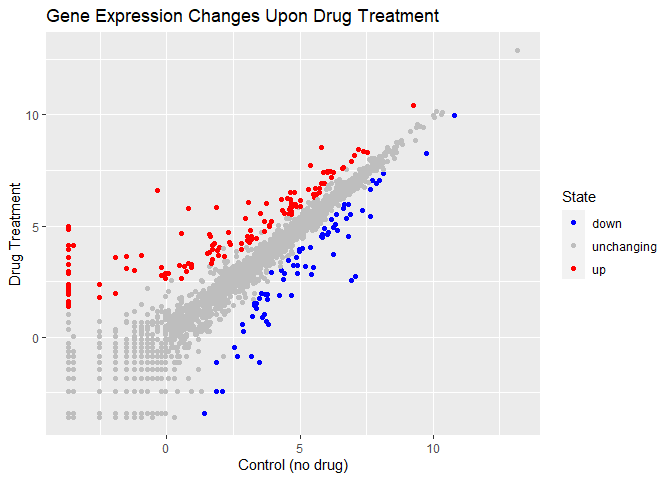
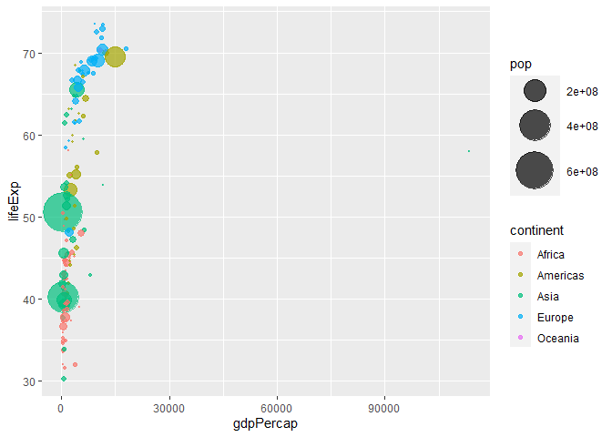
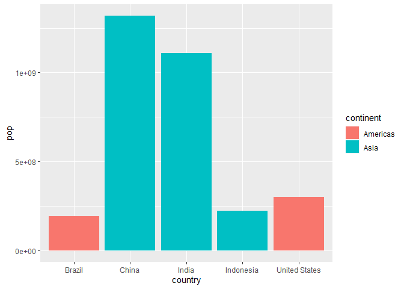
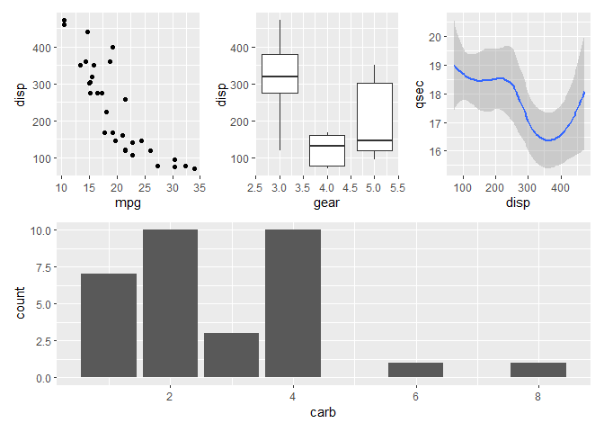

# Class5 Data Visualization with ggplot2
Yufei (PID: A16222438)

## Using ggplot

The ggplot package needs to be installed for the first time of use by
`install.packages("ggplot2")` function.

``` r
#`head()` gives the first 6 items in an item
head (cars)
```

      speed dist
    1     4    2
    2     4   10
    3     7    4
    4     7   22
    5     8   16
    6     9   10

ggplot package needs to be loaded in order to use any functions within
it, by `library()` function.

``` r
library(ggplot2)
```

    Warning: 程辑包'ggplot2'是用R版本4.3.1 来建造的

``` r
ggplot()
```


### Creating graph with ggplot

All ggplot figures have three components: data (what we want to plot) +
aes (how we map data to the plot, e.g. x and y axes) + geom (how we want
to represent the data, e.g. points, lines, columns…)

``` r
ggplot(cars)+
  aes(x = speed, y = dist)+
  geom_point()
```


***Note:*** ggplot is not the only graphing system in R. e.g. “base R”
graphics

``` r
plot(cars$speed, cars$dist)
```


### Further finshing a plot

Label the graph by `labs()` function; Add a trend line by
`geom_smooth()` function; Change plot theme to black-and-white by
`theme_bw()` function

``` r
ggplot(cars)+
  aes(x = speed, y = dist)+
  geom_point() +
#label graph components
  labs(title = "Speed and Stopping Distances of Cars",
       x = "Speed (MPH)",
       y = "Stopping Distance (ft)",
       subtitle = "Positive correlation between speed and stopping distance",
       caption = "Dataset: 'cars'") +
#lm = linear model; se = shaded standard error region
  geom_smooth(method = "lm", se=FALSE) +
#bw = black and white theme
  theme_bw()
```

    `geom_smooth()` using formula = 'y ~ x'


### Adding more plot aesthetics

Importing a data set on antiviral drug

``` r
url <- "https://bioboot.github.io/bimm143_S20/class-material/up_down_expression.txt"
genes <- read.delim(url)

head(genes)
```

            Gene Condition1 Condition2      State
    1      A4GNT -3.6808610 -3.4401355 unchanging
    2       AAAS  4.5479580  4.3864126 unchanging
    3      AASDH  3.7190695  3.4787276 unchanging
    4       AATF  5.0784720  5.0151916 unchanging
    5       AATK  0.4711421  0.5598642 unchanging
    6 AB015752.4 -3.6808610 -3.5921390 unchanging

``` r
nrow(genes)
```

    [1] 5196

``` r
colnames(genes)
```

    [1] "Gene"       "Condition1" "Condition2" "State"     

``` r
ncol(genes)
```

    [1] 4

``` r
table(genes$State)
```


          down unchanging         up 
            72       4997        127 

``` r
round(table(genes$State)/nrow(genes)*100, 2)
```


          down unchanging         up 
          1.39      96.17       2.44 

### Making basic scatter plot

``` r
ggplot(genes) + 
    aes(x=Condition1, y=Condition2) +
    geom_point()
```


Mapping color to State column

``` r
p <- ggplot(genes) + 
    aes(x=Condition1, y=Condition2, col=State) +
    geom_point()
p
```


Finishing up graph by changing color and labelling

``` r
p + 
# Assign color to columns
  scale_colour_manual( values=c("blue","gray","red") )+
  labs(title = "Gene Expression Changes Upon Drug Treatment",
       x = "Control (no drug)",
       y = "Drug Treatment")
```



## Optional Extensions

``` r
# Obtain gapminder package online
url <- "https://raw.githubusercontent.com/jennybc/gapminder/master/inst/extdata/gapminder.tsv"

gapminder <- read.delim(url)

#alternative method: >install.packages("gapminder") >library(gapminder)

#Install & use dplyr package >install.packages("dplyr")
library(dplyr)
```

    Warning: 程辑包'dplyr'是用R版本4.3.1 来建造的


    载入程辑包：'dplyr'

    The following objects are masked from 'package:stats':

        filter, lag

    The following objects are masked from 'package:base':

        intersect, setdiff, setequal, union

``` r
#take gapmider data frame and filter to contain only the rows with a year value of 2007
gapminder_2007 <- gapminder %>% filter(year==2007)
```

Creating plot of gapminder_2007 dataset

``` r
ggplot(gapminder_2007) +
  aes(x=gdpPercap, y=lifeExp) +
  #change point transparency
  geom_point(alpha = 0.4)
```


### Adding more varables to aes()

Coloring the plot by categorical values

``` r
ggplot(gapminder_2007) +
  aes(x=gdpPercap, y=lifeExp, color=continent, size=pop) +
  geom_point(alpha=0.5)
```


Coloring the plot by numerical value

``` r
ggplot(gapminder_2007) + 
  aes(x = gdpPercap, y = lifeExp, color = pop) +
  geom_point(alpha=0.8)
```


Adjusting point size

``` r
ggplot(gapminder_2007) + 
  geom_point(aes(x = gdpPercap, y = lifeExp,
                 size = pop), alpha=0.5) + 
  scale_size_area(max_size = 10)
```


``` r
gapminder_1957 <- gapminder %>% filter(year==1957)

ggplot(gapminder_1957) + 
  aes(x = gdpPercap, y = lifeExp, color=continent,
                 size = pop) +
  geom_point(alpha=0.7) + 
  scale_size_area(max_size = 15) 
```



``` r
gapminder_1957 <- gapminder %>% filter(year==1957 | year==2007)

ggplot(gapminder_1957) + 
  aes(x = gdpPercap, y = lifeExp, color=continent,
                 size = pop) +
  geom_point(alpha=0.7) + 
  scale_size_area(max_size = 10) +
  facet_wrap(~year)
```


## Making bar graphs

``` r
## sorting for top 5 countries with highest population size
gapminder_top5 <- gapminder %>% 
  filter(year==2007) %>% 
  arrange(desc(pop)) %>% 
  top_n(5, pop)

gapminder_top5
```

            country continent year lifeExp        pop gdpPercap
    1         China      Asia 2007  72.961 1318683096  4959.115
    2         India      Asia 2007  64.698 1110396331  2452.210
    3 United States  Americas 2007  78.242  301139947 42951.653
    4     Indonesia      Asia 2007  70.650  223547000  3540.652
    5        Brazil  Americas 2007  72.390  190010647  9065.801

### Creating simple bar chart

``` r
ggplot(gapminder_top5) + 
  geom_col(aes(x = country, y = pop))
```


### Adding aesthetics

Color by categorical variable

``` r
ggplot(gapminder_top5) + 
  geom_col(aes(x = country, y = pop, fill = continent))
```



``` r
ggplot(gapminder_top5) + 
  geom_col(aes(x = country, y = pop, fill = country))
```


Color by numeric variable

``` r
ggplot(gapminder_top5) + 
  geom_col(aes(x = country, y = pop, fill = lifeExp))
```


``` r
ggplot(gapminder_top5) +
  aes(x=country, y=pop, fill=gdpPercap) +
  geom_col()
```


### Flipping bar charts

inbuilt dataset USArrests

``` r
head(USArrests)
```

               Murder Assault UrbanPop Rape
    Alabama      13.2     236       58 21.2
    Alaska       10.0     263       48 44.5
    Arizona       8.1     294       80 31.0
    Arkansas      8.8     190       50 19.5
    California    9.0     276       91 40.6
    Colorado      7.9     204       78 38.7

Plot horizontal bars

``` r
USArrests$State <- rownames(USArrests)
ggplot(USArrests) +
  aes(x=reorder(State,Murder), y=Murder) +
  geom_col() +
  coord_flip()
```


Adding aesthetics

``` r
ggplot(USArrests) +
  aes(x=reorder(State,Murder), y=Murder) +
  geom_point() +
# Make the graph less crowded
  geom_segment(aes(x=State, 
                   xend=State, 
                   y=0, 
                   yend=Murder), color="blue") +
# Flip direction
  coord_flip()
```


## Animation

``` r
# install extension packages >install.packages("gifski") >install.packages("gganimate")
library(gapminder)
```

    Warning: 程辑包'gapminder'是用R版本4.3.1 来建造的


    载入程辑包：'gapminder'

    The following object is masked _by_ '.GlobalEnv':

        gapminder

``` r
library(gganimate)
```

    Warning: 程辑包'gganimate'是用R版本4.3.1 来建造的

``` r
# CODES FOR ANIMATION HIDDEN TO REDUCE PDF REPORT SIZE
# Setup nice regular ggplot of the gapminder data
#ggplot(gapminder, aes(gdpPercap, lifeExp, size = pop, colour = country)) +
  #geom_point(alpha = 0.7, show.legend = FALSE) +
  #scale_colour_manual(values = country_colors) +
  #scale_size(range = c(2, 12)) +
  #scale_x_log10() +
  # Facet by continent
  #facet_wrap(~continent) +
  # Here comes the gganimate specific bits
  #labs(title = 'Year: {frame_time}', x = 'GDP per capita', y = 'life expectancy') +
  #transition_time(year) +
  #shadow_wake(wake_length = 0.1, alpha = FALSE)
```

## Combining Plots

``` r
# Install patchwork package >install.packages(patchwork)
library(patchwork)
```

    Warning: 程辑包'patchwork'是用R版本4.3.1 来建造的

``` r
# Setup some example plots 
p1 <- ggplot(mtcars) + geom_point(aes(mpg, disp))
p2 <- ggplot(mtcars) + geom_boxplot(aes(gear, disp, group = gear))
p3 <- ggplot(mtcars) + geom_smooth(aes(disp, qsec))
p4 <- ggplot(mtcars) + geom_bar(aes(carb))

# Use patchwork to combine them here:
(p1 | p2 | p3) / p4
```

    `geom_smooth()` using method = 'loess' and formula = 'y ~ x'



``` r
# Setup some example plots 
p1 <- ggplot(mtcars) + geom_point(aes(mpg, disp))
p2 <- ggplot(mtcars) + geom_boxplot(aes(gear, disp, group = gear))
p3 <- ggplot(mtcars) + geom_smooth(aes(disp, qsec))
p4 <- ggplot(mtcars) + geom_bar(aes(carb))

# Use patchwork to combine them here:
(p1 | p2 | p3) /
      p4
```

    `geom_smooth()` using method = 'loess' and formula = 'y ~ x'


## Reporting R system Setup

``` r
sessionInfo()
```

    R version 4.3.0 (2023-04-21 ucrt)
    Platform: x86_64-w64-mingw32/x64 (64-bit)
    Running under: Windows 10 x64 (build 19045)

    Matrix products: default


    locale:
    [1] LC_COLLATE=Chinese (Simplified)_China.utf8 
    [2] LC_CTYPE=Chinese (Simplified)_China.utf8   
    [3] LC_MONETARY=Chinese (Simplified)_China.utf8
    [4] LC_NUMERIC=C                               
    [5] LC_TIME=Chinese (Simplified)_China.utf8    

    time zone: America/Los_Angeles
    tzcode source: internal

    attached base packages:
    [1] stats     graphics  grDevices utils     datasets  methods   base     

    other attached packages:
    [1] patchwork_1.1.3 gganimate_1.0.8 gapminder_1.0.0 dplyr_1.1.3    
    [5] ggplot2_3.4.4  

    loaded via a namespace (and not attached):
     [1] Matrix_1.5-4      gtable_0.3.4      jsonlite_1.8.8    crayon_1.5.2     
     [5] compiler_4.3.0    tidyselect_1.2.0  progress_1.2.2    splines_4.3.0    
     [9] scales_1.2.1      yaml_2.3.7        fastmap_1.1.1     lattice_0.21-8   
    [13] R6_2.5.1          labeling_0.4.3    generics_0.1.3    knitr_1.43       
    [17] tibble_3.2.1      munsell_0.5.0     pillar_1.9.0      rlang_1.1.1      
    [21] utf8_1.2.3        stringi_1.7.12    xfun_0.39         cli_3.6.1        
    [25] tweenr_2.0.2      withr_2.5.1       magrittr_2.0.3    mgcv_1.8-42      
    [29] digest_0.6.33     grid_4.3.0        rstudioapi_0.15.0 hms_1.1.3        
    [33] lifecycle_1.0.3   nlme_3.1-162      prettyunits_1.2.0 vctrs_0.6.4      
    [37] evaluate_0.21     glue_1.6.2        farver_2.1.1      gifski_1.12.0-2  
    [41] fansi_1.0.5       colorspace_2.1-0  rmarkdown_2.22    tools_4.3.0      
    [45] pkgconfig_2.0.3   htmltools_0.5.5  
