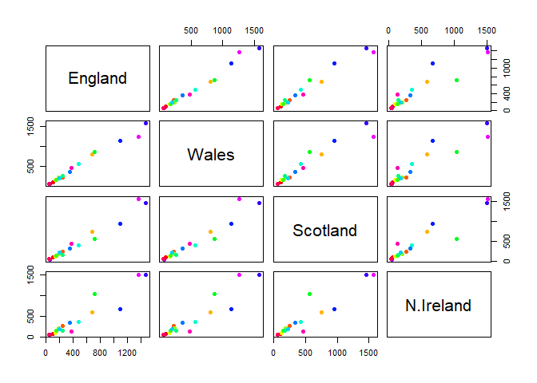

# Class 07: Machine Learning 1
Yufei (A16222438)

# Clustering

We will start today’s lab with clustering methods, in particular
so-called **K-means**. The main function for this in R is `kmeans()`.

Let’s try it on some made-up data where we know the answer.

``` r
# rnorm function draws random points from a normal distribution
# rnorm(number of points, mean, sd). default: z.
x <- rnorm(1000, mean = 3)
hist(x)
```


make 60 points

``` r
# points from two distributions
tmp <- c(rnorm(30, mean = 3), rnorm(30, mean = -3))
# create a y axis as the reversed list of tmp, build matrix by cbind
tdtmp <- cbind(x=tmp, y=rev(tmp))
#check the data
head (tdtmp)
```

                x         y
    [1,] 1.584788 -2.386967
    [2,] 2.747234 -1.405591
    [3,] 2.566846 -2.283464
    [4,] 4.513972 -3.960591
    [5,] 3.218199 -3.879755
    [6,] 1.417171 -2.638737

``` r
#plot the data
plot (tdtmp)
```


K-means clustering of two sets of points of size 30, 30.

``` r
# identify the two clusters by kmeans(). Iteration = 20 times.
k <- kmeans (tdtmp, centers = 2, nstart = 20)
k
```

    K-means clustering with 2 clusters of sizes 30, 30

    Cluster means:
              x         y
    1  2.994948 -3.013257
    2 -3.013257  2.994948

    Clustering vector:
     [1] 1 1 1 1 1 1 1 1 1 1 1 1 1 1 1 1 1 1 1 1 1 1 1 1 1 1 1 1 1 1 2 2 2 2 2 2 2 2
    [39] 2 2 2 2 2 2 2 2 2 2 2 2 2 2 2 2 2 2 2 2 2 2

    Within cluster sum of squares by cluster:
    [1] 68.31536 68.31536
     (between_SS / total_SS =  88.8 %)

    Available components:

    [1] "cluster"      "centers"      "totss"        "withinss"     "tot.withinss"
    [6] "betweenss"    "size"         "iter"         "ifault"      

**Q1.** How many points are in each cluster?

``` r
k$size
```

    [1] 30 30

**Q2** Cluster membership?

``` r
k$cluster
```

     [1] 1 1 1 1 1 1 1 1 1 1 1 1 1 1 1 1 1 1 1 1 1 1 1 1 1 1 1 1 1 1 2 2 2 2 2 2 2 2
    [39] 2 2 2 2 2 2 2 2 2 2 2 2 2 2 2 2 2 2 2 2 2 2

**Q3.** Cluster centers?

``` r
k$centers
```

              x         y
    1  2.994948 -3.013257
    2 -3.013257  2.994948

**Q4.** Plot my clustering results?

``` r
plot(tdtmp, col = k$cluster+2, pch = 16)
```


**Q5.** Cluster the data again with kmeans() into 4 groups and plot the
results.

``` r
kf <- kmeans(tdtmp, centers = 4, nstart = 20)
plot(tdtmp, col = kf$cluster, pch = 16)
```


K-means is very popular mostly because it is fast and relatively
straightforward to run and understand. But it has a big limitation in
that you need to tell it how many groups (k, or centers) you want. If we
don’t know k beforehand, we need trial and error to obtain the optimal
result with minimal SS and cluster number.

# Hierachical clustering

The main function in base R is called `hclust()`. You have to pass it in
a “distance matrix” not just your input data.

We can generate a distance matrix with the `dist()` function.

``` r
hc <- hclust (dist(tdtmp))
hc
```


    Call:
    hclust(d = dist(tdtmp))

    Cluster method   : complete 
    Distance         : euclidean 
    Number of objects: 60 

``` r
plot(hc)
```


Interpretation: - It grouped the numbers into two groups: \<=30(left)
and \>30(right). - Height of bars = distance of points. - Determine
number of clusters by observing the number of highest bars.

To find clusters (cluster membership vector) from a ‘hclust()’ result,
we can “cut” the tree at a certain height that we like

``` r
# cut the tree on plot
plot(hc)
abline(h=8, col = "red")
```


``` r
#get membership vector
grps <- cutree(hc, h=8)
table(grps)
```

    grps
     1  2 
    30 30 

Plot the result

``` r
plot(tdtmp, col=grps+2, pch = 16)
```


# PCA: Principal Component Analysis

Read the data consumption in grams (per person, per week) of 17
different types of food-stuff measured and averaged in the four
countries of the United Kingdom in 1997.

``` r
x <- read.csv("https://tinyurl.com/UK-foods")
```

**Q1.** How many rows and columns are in your new data frame named x?
What R functions could you use to answer this questions?

``` r
nrow(x)
```

    [1] 17

``` r
ncol(x)
```

    [1] 5

``` r
#or
dim(x)
```

    [1] 17  5

``` r
# Checking data
head(x)
```

                   X England Wales Scotland N.Ireland
    1         Cheese     105   103      103        66
    2  Carcass_meat      245   227      242       267
    3    Other_meat      685   803      750       586
    4           Fish     147   160      122        93
    5 Fats_and_oils      193   235      184       209
    6         Sugars     156   175      147       139

It looks like the row-names here were not set properly as we were
expecting 4 columns (one for each of the 4 countries of the UK - not 5
as reported from the dim() function)

``` r
rownames(x) <- x[,1]
food <- x[,-1]
head(x)
```

                                X England Wales Scotland N.Ireland
    Cheese                 Cheese     105   103      103        66
    Carcass_meat    Carcass_meat      245   227      242       267
    Other_meat        Other_meat      685   803      750       586
    Fish                     Fish     147   160      122        93
    Fats_and_oils  Fats_and_oils      193   235      184       209
    Sugars                 Sugars     156   175      147       139

It is dangerous way of processing data as it deletes the first column
every time we run this code, until all columns removed.

Instead, we can read the data properly

``` r
x <- read.csv("https://tinyurl.com/UK-foods", row.names = 1)
head(x)
```

                   England Wales Scotland N.Ireland
    Cheese             105   103      103        66
    Carcass_meat       245   227      242       267
    Other_meat         685   803      750       586
    Fish               147   160      122        93
    Fats_and_oils      193   235      184       209
    Sugars             156   175      147       139

**Q2.** Which approach to solving the ‘row-names problem’ mentioned
above do you prefer and why? Is one approach more robust than another
under certain circumstances?

We can do bar plots

``` r
barplot(as.matrix(x), beside=T, col=rainbow(nrow(x)))
```


**Q3:** Changing what optional argument in the above barplot() function
results in the following plot?

``` r
barplot(as.matrix(x), beside=F, col=rainbow(nrow(x)))
```


**Q5:** Generating all pairwise plots may help somewhat. Can you make
sense of the following code and resulting figure? What does it mean if a
given point lies on the diagonal for a given plot?

A pairs plot can be useful, if we don’t have much dimensions

``` r
pairs(x, col = rainbow(nrow(x)), pch = 16)
```



Interpretation: X and Y axis represent data from corresponding country,
color of dot represent food category. Deviation from diagonal represent
difference in data. Drawback: time-consuming and confusing to interpret.

**Q6.** What is the main differences between N. Ireland and the other
countries of the UK in terms of this data-set?

## PCA of UK Food Data (17 dimensions)

PCA can help us make sense of these types of datasets. Let’s see how it
works.

The main function in “base” R is called `prcomp()`. It needs matrix
column to be the dimensions of analysis (in this case food type), and
row to be group (in this case countries).

``` r
#transpose x by `t()` function
head(t(x))
```

              Cheese Carcass_meat  Other_meat  Fish Fats_and_oils  Sugars
    England      105           245         685  147            193    156
    Wales        103           227         803  160            235    175
    Scotland     103           242         750  122            184    147
    N.Ireland     66           267         586   93            209    139
              Fresh_potatoes  Fresh_Veg  Other_Veg  Processed_potatoes 
    England               720        253        488                 198
    Wales                 874        265        570                 203
    Scotland              566        171        418                 220
    N.Ireland            1033        143        355                 187
              Processed_Veg  Fresh_fruit  Cereals  Beverages Soft_drinks 
    England              360         1102     1472        57         1374
    Wales                365         1137     1582        73         1256
    Scotland             337          957     1462        53         1572
    N.Ireland            334          674     1494        47         1506
              Alcoholic_drinks  Confectionery 
    England                 375             54
    Wales                   475             64
    Scotland                458             62
    N.Ireland               135             41

``` r
pca <- prcomp(t(x))
summary(pca)
```

    Importance of components:
                                PC1      PC2      PC3       PC4
    Standard deviation     324.1502 212.7478 73.87622 3.176e-14
    Proportion of Variance   0.6744   0.2905  0.03503 0.000e+00
    Cumulative Proportion    0.6744   0.9650  1.00000 1.000e+00

Interpretation: PC1 captures 67.44% of variance, and PC2 captures 96.5%
variance in data.

``` r
pca$x
```

                     PC1         PC2        PC3           PC4
    England   -144.99315   -2.532999 105.768945 -4.894696e-14
    Wales     -240.52915 -224.646925 -56.475555  5.700024e-13
    Scotland   -91.86934  286.081786 -44.415495 -7.460785e-13
    N.Ireland  477.39164  -58.901862  -4.877895  2.321303e-13

``` r
plot(pca$x[,1],pca$x[,2], col = c("orange", "red", "blue", "darkgreen"), pch = 16)
```


The “loadings” tell us how much the original variables (in our case,
food) contribute to the new variable (PC).

``` r
pca$rotation
```

                                 PC1          PC2         PC3          PC4
    Cheese              -0.056955380  0.016012850  0.02394295 -0.694538519
    Carcass_meat         0.047927628  0.013915823  0.06367111  0.489884628
    Other_meat          -0.258916658 -0.015331138 -0.55384854  0.279023718
    Fish                -0.084414983 -0.050754947  0.03906481 -0.008483145
    Fats_and_oils       -0.005193623 -0.095388656 -0.12522257  0.076097502
    Sugars              -0.037620983 -0.043021699 -0.03605745  0.034101334
    Fresh_potatoes       0.401402060 -0.715017078 -0.20668248 -0.090972715
    Fresh_Veg           -0.151849942 -0.144900268  0.21382237 -0.039901917
    Other_Veg           -0.243593729 -0.225450923 -0.05332841  0.016719075
    Processed_potatoes  -0.026886233  0.042850761 -0.07364902  0.030125166
    Processed_Veg       -0.036488269 -0.045451802  0.05289191 -0.013969507
    Fresh_fruit         -0.632640898 -0.177740743  0.40012865  0.184072217
    Cereals             -0.047702858 -0.212599678 -0.35884921  0.191926714
    Beverages           -0.026187756 -0.030560542 -0.04135860  0.004831876
    Soft_drinks          0.232244140  0.555124311 -0.16942648  0.103508492
    Alcoholic_drinks    -0.463968168  0.113536523 -0.49858320 -0.316290619
    Confectionery       -0.029650201  0.005949921 -0.05232164  0.001847469

``` r
#plot PC1, with graph margin of 2
barplot(pca$rotation[,1], las = 2)
```


