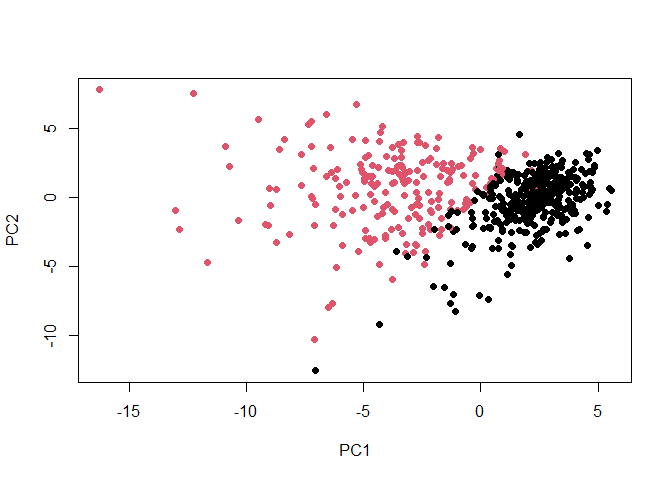
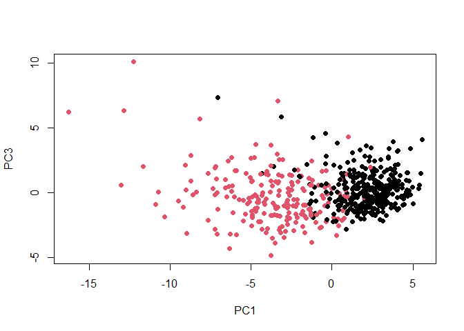
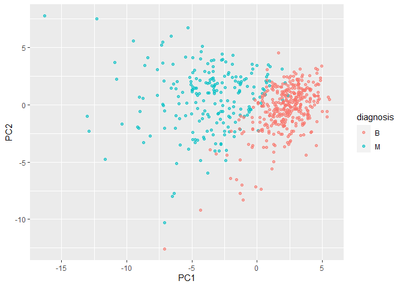
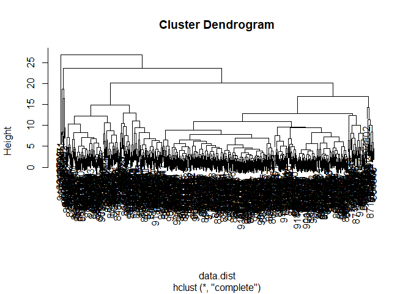
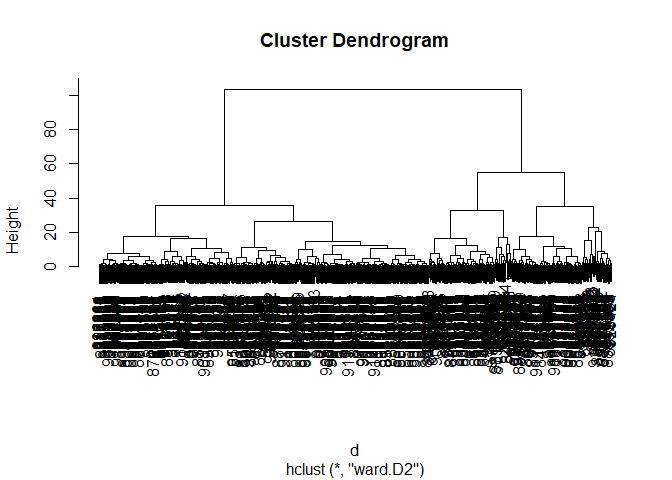
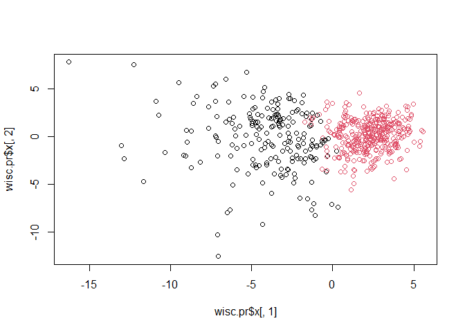

# Class 08: Mini Project
Yufei (A16222438)

# Outline

TOday we will apply the machine learning method we introduced last class
on breast cancer biopsy from fine needle aspiration.

# Preparing the data

The data is supplied on CSV format. Downloaded from class website and
saved to project folder. We want the patient id (first col) to be name
of rows, instead of being analyzed as data.

``` r
wisc.df <- read.csv("WisconsinCancer.csv", row.names=1)
```

Examine input data.

``` r
head(wisc.df)
```

             diagnosis radius_mean texture_mean perimeter_mean area_mean
    842302           M       17.99        10.38         122.80    1001.0
    842517           M       20.57        17.77         132.90    1326.0
    84300903         M       19.69        21.25         130.00    1203.0
    84348301         M       11.42        20.38          77.58     386.1
    84358402         M       20.29        14.34         135.10    1297.0
    843786           M       12.45        15.70          82.57     477.1
             smoothness_mean compactness_mean concavity_mean concave.points_mean
    842302           0.11840          0.27760         0.3001             0.14710
    842517           0.08474          0.07864         0.0869             0.07017
    84300903         0.10960          0.15990         0.1974             0.12790
    84348301         0.14250          0.28390         0.2414             0.10520
    84358402         0.10030          0.13280         0.1980             0.10430
    843786           0.12780          0.17000         0.1578             0.08089
             symmetry_mean fractal_dimension_mean radius_se texture_se perimeter_se
    842302          0.2419                0.07871    1.0950     0.9053        8.589
    842517          0.1812                0.05667    0.5435     0.7339        3.398
    84300903        0.2069                0.05999    0.7456     0.7869        4.585
    84348301        0.2597                0.09744    0.4956     1.1560        3.445
    84358402        0.1809                0.05883    0.7572     0.7813        5.438
    843786          0.2087                0.07613    0.3345     0.8902        2.217
             area_se smoothness_se compactness_se concavity_se concave.points_se
    842302    153.40      0.006399        0.04904      0.05373           0.01587
    842517     74.08      0.005225        0.01308      0.01860           0.01340
    84300903   94.03      0.006150        0.04006      0.03832           0.02058
    84348301   27.23      0.009110        0.07458      0.05661           0.01867
    84358402   94.44      0.011490        0.02461      0.05688           0.01885
    843786     27.19      0.007510        0.03345      0.03672           0.01137
             symmetry_se fractal_dimension_se radius_worst texture_worst
    842302       0.03003             0.006193        25.38         17.33
    842517       0.01389             0.003532        24.99         23.41
    84300903     0.02250             0.004571        23.57         25.53
    84348301     0.05963             0.009208        14.91         26.50
    84358402     0.01756             0.005115        22.54         16.67
    843786       0.02165             0.005082        15.47         23.75
             perimeter_worst area_worst smoothness_worst compactness_worst
    842302            184.60     2019.0           0.1622            0.6656
    842517            158.80     1956.0           0.1238            0.1866
    84300903          152.50     1709.0           0.1444            0.4245
    84348301           98.87      567.7           0.2098            0.8663
    84358402          152.20     1575.0           0.1374            0.2050
    843786            103.40      741.6           0.1791            0.5249
             concavity_worst concave.points_worst symmetry_worst
    842302            0.7119               0.2654         0.4601
    842517            0.2416               0.1860         0.2750
    84300903          0.4504               0.2430         0.3613
    84348301          0.6869               0.2575         0.6638
    84358402          0.4000               0.1625         0.2364
    843786            0.5355               0.1741         0.3985
             fractal_dimension_worst
    842302                   0.11890
    842517                   0.08902
    84300903                 0.08758
    84348301                 0.17300
    84358402                 0.07678
    843786                   0.12440

We want to exclude the *diagnosis* column for the aim of PCA. Delete and
make a new *wisc.data* data frame for analysis, and save diagnosis to a
new vector *diagnosis*

``` r
wisc.data <- wisc.df[,-1]
diagnosis <- as.factor(wisc.df[,1])
```

## Exploratory data analysis

**Q1.** How many observations are in this dataset?

``` r
nrow(wisc.data)
```

    [1] 569

**Q2.** How many of the observations have a malignant diagnosis?

``` r
sum(diagnosis == "M")
```

    [1] 212

``` r
#or
table(diagnosis)
```

    diagnosis
      B   M 
    357 212 

**Q3.** How many variables/features in the data are suffixed with mean?

``` r
# We can find objects with certain pattern by `grep(pattern, x)`
length(grep("_mean", colnames(wisc.df)))
```

    [1] 10

# Principal Component Analysis

## Performing PCA

It is important to check if the data need to be scaled before performing
PCA. Two common reasons for scaling data include: - The input variables
use different units of measurement. - The input variables have
significantly different variances.

The upshot here is we set `scale = TRUE` argument to `prcomp()`.

``` r
# Check column means and standard deviations
wisc.pr <- prcomp(wisc.data, scale = TRUE)
summary(wisc.pr)
```

    Importance of components:
                              PC1    PC2     PC3     PC4     PC5     PC6     PC7
    Standard deviation     3.6444 2.3857 1.67867 1.40735 1.28403 1.09880 0.82172
    Proportion of Variance 0.4427 0.1897 0.09393 0.06602 0.05496 0.04025 0.02251
    Cumulative Proportion  0.4427 0.6324 0.72636 0.79239 0.84734 0.88759 0.91010
                               PC8    PC9    PC10   PC11    PC12    PC13    PC14
    Standard deviation     0.69037 0.6457 0.59219 0.5421 0.51104 0.49128 0.39624
    Proportion of Variance 0.01589 0.0139 0.01169 0.0098 0.00871 0.00805 0.00523
    Cumulative Proportion  0.92598 0.9399 0.95157 0.9614 0.97007 0.97812 0.98335
                              PC15    PC16    PC17    PC18    PC19    PC20   PC21
    Standard deviation     0.30681 0.28260 0.24372 0.22939 0.22244 0.17652 0.1731
    Proportion of Variance 0.00314 0.00266 0.00198 0.00175 0.00165 0.00104 0.0010
    Cumulative Proportion  0.98649 0.98915 0.99113 0.99288 0.99453 0.99557 0.9966
                              PC22    PC23   PC24    PC25    PC26    PC27    PC28
    Standard deviation     0.16565 0.15602 0.1344 0.12442 0.09043 0.08307 0.03987
    Proportion of Variance 0.00091 0.00081 0.0006 0.00052 0.00027 0.00023 0.00005
    Cumulative Proportion  0.99749 0.99830 0.9989 0.99942 0.99969 0.99992 0.99997
                              PC29    PC30
    Standard deviation     0.02736 0.01153
    Proportion of Variance 0.00002 0.00000
    Cumulative Proportion  1.00000 1.00000

**Q4.** From your results, what proportion of the original variance is
captured by the first principal components (PC1)? - Cumulative
Proportion of PC1 = 0.4427

**Q5.** How many principal components (PCs) are required to describe at
least 70% of the original variance in the data? - 3, because cumulative
proportion reaches 70% at PC3.

**Q6.** How many principal components (PCs) are required to describe at
least 90% of the original variance in the data? - 7.

## Interpreting PCA results

Visualization is a useful tool to interpret PCA data. A common
visualization for PCA results is the so-called biplot (function:
`biplot()`)

``` r
biplot(wisc.pr)
```


Problem: Row names are used as the plotting character for biplots like
this one which can make trends rather hard to see.

Let’s make a more standard scatter plot.

``` r
# plot where a patient lies on new PC1 & 2 axis
plot(wisc.pr$x[,1], wisc.pr$x[,2], col = diagnosis, pch = 16, xlab = "PC1", ylab = "PC2")
```



**Q8.** Generate a similar plot for principal components 1 and 3. What
do you notice about these plots?

``` r
plot(wisc.pr$x[,1], wisc.pr$x[,3], col = diagnosis, pch = 16, xlab = "PC1", ylab = "PC3")
```



The two groups are less separated than the plot using PC1 and 2. This is
because PC2 explains more difference in the data points than PC3.

As this is such a striking result let’s see if we can use the ggplot2
package to make a more fancy figure of these results.

``` r
# Create a data.frame for ggplot
df <- as.data.frame(wisc.pr$x)
df$diagnosis <- diagnosis

# Load the ggplot2 package
library(ggplot2)
```

    Warning: 程辑包'ggplot2'是用R版本4.3.1 来建造的

``` r
# Make a scatter plot colored by diagnosis
ggplot(df) + 
  aes(PC1, PC2, col=diagnosis) + 
  geom_point(alpha = 0.6)
```



## Variance explained

We can produce scree plots showing the proportion of variance explained
as the number of principal components increases. Calculate the variance
of each principal component by squaring the stdev component of data.

``` r
pr.var <- wisc.pr$sdev^2
head(pr.var)
```

    [1] 13.281608  5.691355  2.817949  1.980640  1.648731  1.207357

Then we can calculate the variance explained by each principal component
by dividing by the total variance explained of all principal components.

``` r
# Variance explained by each principal component: pve
pve <- pr.var/sum(pr.var)

# Plot variance explained for each principal component
plot(pve, xlab = "Principal Component", 
     ylab = "Proportion of Variance Explained", 
     ylim = c(0, 1), type = "o")
```


``` r
# Alternative scree plot of the same data, note data driven y-axis
barplot(pve, ylab = "Precent of Variance Explained",
     names.arg=paste0("PC",1:length(pve)), las=2, axes = FALSE)
axis(2, at=pve, labels=round(pve,2)*100 )
```


## Communicating PCA results

**Q9.** For the first principal component, what is the component of the
loading vector (i.e. wisc.pr\$rotation\[,1\]) for the feature
concave.points_mean?

``` r
wisc.pr$rotation[,1]
```

                radius_mean            texture_mean          perimeter_mean 
                -0.21890244             -0.10372458             -0.22753729 
                  area_mean         smoothness_mean        compactness_mean 
                -0.22099499             -0.14258969             -0.23928535 
             concavity_mean     concave.points_mean           symmetry_mean 
                -0.25840048             -0.26085376             -0.13816696 
     fractal_dimension_mean               radius_se              texture_se 
                -0.06436335             -0.20597878             -0.01742803 
               perimeter_se                 area_se           smoothness_se 
                -0.21132592             -0.20286964             -0.01453145 
             compactness_se            concavity_se       concave.points_se 
                -0.17039345             -0.15358979             -0.18341740 
                symmetry_se    fractal_dimension_se            radius_worst 
                -0.04249842             -0.10256832             -0.22799663 
              texture_worst         perimeter_worst              area_worst 
                -0.10446933             -0.23663968             -0.22487053 
           smoothness_worst       compactness_worst         concavity_worst 
                -0.12795256             -0.21009588             -0.22876753 
       concave.points_worst          symmetry_worst fractal_dimension_worst 
                -0.25088597             -0.12290456             -0.13178394 

concave.points_mean = -0.26085376

**Q10.** What is the minimum number of principal components required to
explain 80% of the variance of the data?

``` r
which(cumsum(pve)>0.8)[1]
```

    [1] 5

# Hierarchical clustering

As part of the preparation for hierarchical clustering, the distance
between all pairs of observations are computed.

``` r
# Scale the wisc.data data using the "scale()" function
data.scaled <- scale(wisc.data)

# Calculate the data distance
data.dist <- dist(data.scaled)

# Create a hierarchical clustering model using complete linkage. 
wisc.hclust <- hclust(data.dist, method = "complete")
```

## Result of Hierarchical Clustering

**Q11.** Using the plot() and abline() functions, what is the height at
which the clustering model has 4 clusters?

``` r
plot(wisc.hclust)
abline(h=19, col="red", lty=2)
```


## Selecting number of clusters

Use `cutree()` to cut the tree so that it has 4 clusters

``` r
wisc.hclust.clusters <- cutree (wisc.hclust, k=4)
table(wisc.hclust.clusters, diagnosis)
```

                        diagnosis
    wisc.hclust.clusters   B   M
                       1  12 165
                       2   2   5
                       3 343  40
                       4   0   2

Interpretation: cluster 1 corresponds to Maligant, cluster 3 corresponds
to benign cells.

**Q12.** Can you find a better cluster vs diagnoses match by cutting
into a different number of clusters between 2 and 10?

``` r
CDmatch <- function(x) {
  wisc.hclust.clusters.n <- cutree (wisc.hclust, k=x)
  table(wisc.hclust.clusters.n, diagnosis)
}
ncluster <- 2:10
lapply(2:10, CDmatch)
```

    [[1]]
                          diagnosis
    wisc.hclust.clusters.n   B   M
                         1 357 210
                         2   0   2

    [[2]]
                          diagnosis
    wisc.hclust.clusters.n   B   M
                         1 355 205
                         2   2   5
                         3   0   2

    [[3]]
                          diagnosis
    wisc.hclust.clusters.n   B   M
                         1  12 165
                         2   2   5
                         3 343  40
                         4   0   2

    [[4]]
                          diagnosis
    wisc.hclust.clusters.n   B   M
                         1  12 165
                         2   0   5
                         3 343  40
                         4   2   0
                         5   0   2

    [[5]]
                          diagnosis
    wisc.hclust.clusters.n   B   M
                         1  12 165
                         2   0   5
                         3 331  39
                         4   2   0
                         5  12   1
                         6   0   2

    [[6]]
                          diagnosis
    wisc.hclust.clusters.n   B   M
                         1  12 165
                         2   0   3
                         3 331  39
                         4   2   0
                         5  12   1
                         6   0   2
                         7   0   2

    [[7]]
                          diagnosis
    wisc.hclust.clusters.n   B   M
                         1  12  86
                         2   0  79
                         3   0   3
                         4 331  39
                         5   2   0
                         6  12   1
                         7   0   2
                         8   0   2

    [[8]]
                          diagnosis
    wisc.hclust.clusters.n   B   M
                         1  12  86
                         2   0  79
                         3   0   3
                         4 331  39
                         5   2   0
                         6  12   0
                         7   0   2
                         8   0   2
                         9   0   1

    [[9]]
                          diagnosis
    wisc.hclust.clusters.n   B   M
                        1   12  86
                        2    0  59
                        3    0   3
                        4  331  39
                        5    0  20
                        6    2   0
                        7   12   0
                        8    0   2
                        9    0   2
                        10   0   1

No. 4 cluster is the best solution. Lower cluster number cannot separate
the malignant from benign, while higher cluster number doesn’t help to
improve resolution.

## Using different methods

we can use to combine points during the hierarchical clustering
procedure. These include “single”, “complete”, “average” and “ward.D2”

**Q13.** Which method gives your favorite results for the same data.dist
dataset? Explain your reasoning.

``` r
plot(hclust(data.dist, method = "single"))
```


``` r
plot(hclust(data.dist, method = "complete"))
```



``` r
plot(hclust(data.dist, method = "average"))
```


``` r
plot(hclust(data.dist, method = "ward.D2"))
```


“ward.D2” gives the best result as it clearly separates the population
into two clusters, which is exactly what we want.

**Side-note:** The method=“ward.D2”creates groups such that variance is
minimized within clusters. This has the effect of looking for spherical
clusters with the process starting with all points in individual
clusters (bottom up) and then repeatedly merging a pair of clusters such
that when merged there is a minimum increase in total within-cluster
variance This process continues until a single group including all
points (the top of the tree) is defined.

# OPTIONAL: K-means clustering

``` r
wisc.km <- kmeans(data.dist, centers= 2, nstart= 20)
table(wisc.km$cluster, diagnosis)
```

       diagnosis
          B   M
      1  20 134
      2 337  78

``` r
wisc.hclust.wD <- hclust(data.dist, method = "ward.D2")
wisc.hclust.clusters.wD <- cutree (wisc.hclust, k=2)
table(wisc.hclust.clusters.wD, diagnosis)
```

                           diagnosis
    wisc.hclust.clusters.wD   B   M
                          1 357 210
                          2   0   2

**Q14.** How well does k-means separate the two diagnoses? How does it
compare to your hclust results?

The hclust result using “ward.D2” method produced better results in that
the malignant cell is better separated from benign cells in each
clusters.

# Combining Methods

This approach will take out origional data but our PCA results and work
with them.

``` r
# take the first 3 PCs, calculate distance matrix
d <- dist(wisc.pr$x[,1:3])
wisc.pr.hclust <- hclust(d, method = "ward.D2")
plot(wisc.pr.hclust)
```



Generate 2 cluster groups

``` r
grps <- cutree(wisc.pr.hclust, k=2)
table(grps)
```

    grps
      1   2 
    203 366 

``` r
table(grps, diagnosis)
```

        diagnosis
    grps   B   M
       1  24 179
       2 333  33

``` r
plot(wisc.pr$x[,1], wisc.pr$x[,2], col = grps)
```



``` r
plot(wisc.pr$x[,1:2], col=diagnosis)
```


**Q15.** How well does the newly created model with four clusters
separate out the two diagnoses? Compare our result with expert diagnosis

``` r
table(grps)
```

    grps
      1   2 
    203 366 

``` r
table(diagnosis)
```

    diagnosis
      B   M 
    357 212 

``` r
table(grps, diagnosis)
```

        diagnosis
    grps   B   M
       1  24 179
       2 333  33

Interpretation: 24 – false positive; 33 – false negative; 179 – true
negative; 333 – true positive. Given that the true values are
significantly more than the negative values, the new model separates the
diagnoses quite well.

**Q16.** How well do the k-means and hierarchical clustering models you
created in previous sections (i.e. before PCA) do in terms of separating
the diagnoses? Again, use the table() function to compare the output of
each model (wisc.km\$cluster and wisc.hclust.clusters) with the vector
containing the actual diagnoses.

``` r
table(wisc.km$cluster, diagnosis)
```

       diagnosis
          B   M
      1  20 134
      2 337  78

``` r
table(wisc.hclust.clusters, diagnosis)
```

                        diagnosis
    wisc.hclust.clusters   B   M
                       1  12 165
                       2   2   5
                       3 343  40
                       4   0   2

``` r
table(grps, diagnosis)
```

        diagnosis
    grps   B   M
       1  24 179
       2 333  33
