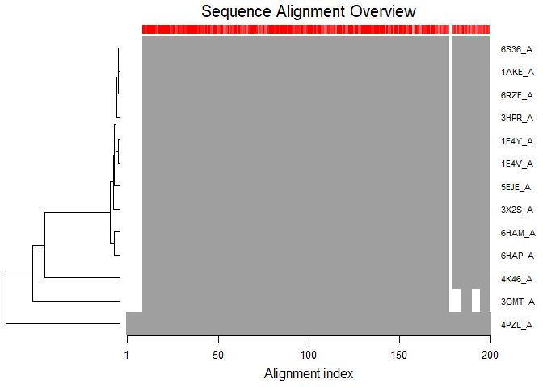
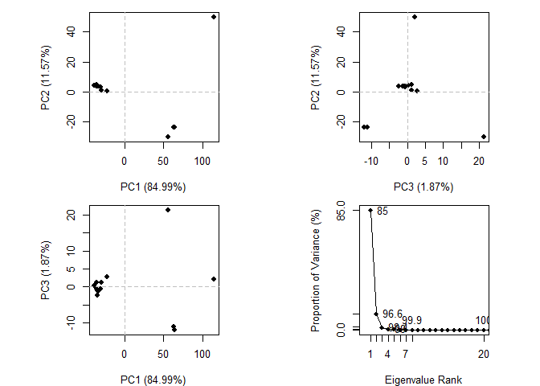
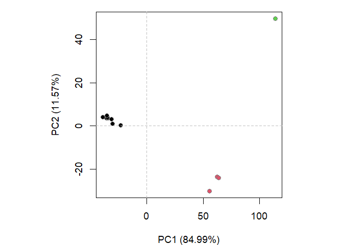
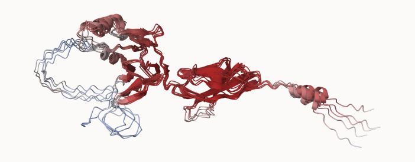
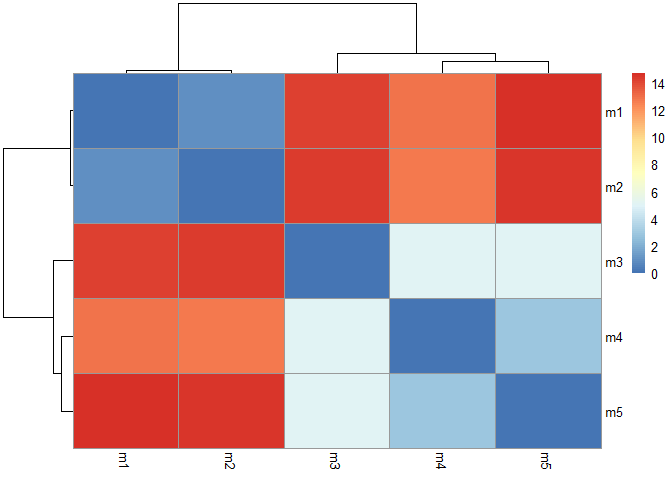
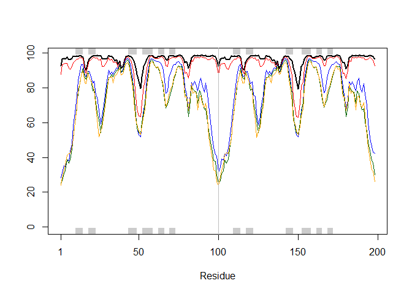
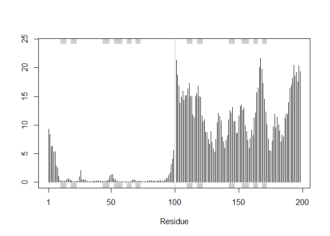
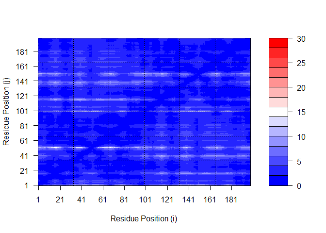
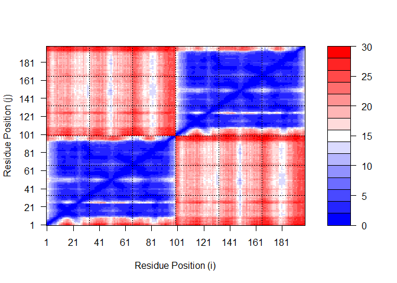

# Class10: Comparative Analysis of Structures
Yufei (A16222438)

We need some packages for today’s class, including `bio3d` and `msa`.

The `msa` package is from BioConductor. These packages focus on genomics
type work and are managed by the `BiocManager` package

install BiocManager by `install.packages()`, then
`BiocManager::install("msa")` in thr R console.

``` r
library(bio3d)
```

    Warning: package 'bio3d' was built under R version 4.3.1

``` r
# Human TRIM46 protein isoform3, refseq accession NP_001393174
aa <- get.seq("NP_001393174")
```

    Warning in get.seq("NP_001393174"): Removing existing file: seqs.fasta

    Fetching... Please wait. Done.

``` r
aa
```

                     1        .         .         .         .         .         60 
    NP_001393174.1   MAEGEDMQTFTSIMDALVRISLCSGEREARDRGLGRSVNQPKAGALEKLQTSMKNMEKEL
                     1        .         .         .         .         .         60 

                    61        .         .         .         .         .         120 
    NP_001393174.1   LCPVCQEMYKQPLVLPCTHNVCQACAREVLGQQGYIGHGGDPSSEPTSPASTPSTRSPRL
                    61        .         .         .         .         .         120 

                   121        .         .         .         .         .         180 
    NP_001393174.1   SRRTLPKPDRLDRLLKSGFGTYPGRKRGALHPQVIMFPCPACQGDVELGERGLAGLFRNL
                   121        .         .         .         .         .         180 

                   181        .         .         .         .         .         240 
    NP_001393174.1   TLERVVERYRQSVSVGGAILCQLCKPPPLEATKGCTECRATFCNECFKLFHPWGTQKAQH
                   181        .         .         .         .         .         240 

                   241        .         .         .         .         .         300 
    NP_001393174.1   EPTLPTLSFRPKGLMCPDHKEEVTHYCKTCQRLVCQLCRVRRTHSGHKITPVLSAYQALK
                   241        .         .         .         .         .         300 

                   301        .         .         .         .         .         360 
    NP_001393174.1   DKLTKSLTYILGNQDTVQTQICELEEAVRHTEVSGQQAKEEVSQLVRGLGAVLEEKRASL
                   301        .         .         .         .         .         360 

                   361        .         .         .         .         .         420 
    NP_001393174.1   LQAIEECQQERLARLSAQIQEHRSLLDGSGLVGYAQEVLKETDQPCFVQAAKQLHNRIAR
                   361        .         .         .         .         .         420 

                   421        .         .         .         .         .         480 
    NP_001393174.1   ATEALQTFRPAASSSFRHCQLDVGREMKLLTELNFLRVPEAPVIDTQRTFAYDQIFLCWR
                   421        .         .         .         .         .         480 

                   481        .         .         .         .         .         540 
    NP_001393174.1   LPPHSPPAWHYTVEFRRTDVPAQPGPTRWQRREEVRGTSALLENPDTGSVYVLRVRGCNK
                   481        .         .         .         .         .         540 

                   541        .         .         .         .         .         600 
    NP_001393174.1   AGYGEYSEDVHLHTPPAPVLHFFLDSRWGASRERLAISKDQRAVRSVPGLPLLLAADRLL
                   541        .         .         .         .         .         600 

                   601        .         .         .         .         .         660 
    NP_001393174.1   TGCHLSVDVVLGDVAVTQGRSYWACAVDPASYLVKVGVGLESKLQESFQGAPDVISPRYD
                   601        .         .         .         .         .         660 

                   661        .         .         .         .         .         720 
    NP_001393174.1   PDSGHDSGAEDATVEASPPFAFLTIGMGKILLGSGASSNAGLTGRDGPTAGCTVPLPPRL
                   661        .         .         .         .         .         720 

                   721        .         .         .         .         .         780 
    NP_001393174.1   GICLDYERGRVSFLDAVSFRGLLECPLDCSGPVCPAFCFIGGGAVQLQEPVGTKPERKVT
                   721        .         .         .         .         .         780 

                   781      788 
    NP_001393174.1   IGGFAKLD
                   781      788 

    Call:
      read.fasta(file = outfile)

    Class:
      fasta

    Alignment dimensions:
      1 sequence rows; 788 position columns (788 non-gap, 0 gap) 

    + attr: id, ali, call

Now I can seqrch the PDB database for related sequences

``` r
#b <- blast.pdb(aa)
#head(b)
```

``` r
# Plot a summary of results
#hits <- plot (b)
```

List out some top hits

``` r
#hits
```

This protein only has one hit in PDB… Proceed with class example for
practice.

``` r
hits <- NULL
hits$pdb.id <- c('1AKE_A','6S36_A','6RZE_A','3HPR_A','1E4V_A','5EJE_A','1E4Y_A','3X2S_A','6HAP_A','6HAM_A','4K46_A','3GMT_A','4PZL_A')
```

Side-note: Let’s annotate these structures (in other words, find out
what they arem what species they are from, stuff about the experiment
they were solved in etc.)

We can use `pdb.annotate()` for this.

``` r
anno <- pdb.annotate(hits$pdb.id)

attributes(anno)
```

    $names
     [1] "structureId"           "chainId"               "macromoleculeType"    
     [4] "chainLength"           "experimentalTechnique" "resolution"           
     [7] "scopDomain"            "pfam"                  "ligandId"             
    [10] "ligandName"            "source"                "structureTitle"       
    [13] "citation"              "rObserved"             "rFree"                
    [16] "rWork"                 "spaceGroup"           

    $class
    [1] "data.frame"

    $row.names
     [1] "1AKE_A" "6S36_A" "6RZE_A" "3HPR_A" "1E4V_A" "5EJE_A" "1E4Y_A" "3X2S_A"
     [9] "6HAP_A" "6HAM_A" "4K46_A" "3GMT_A" "4PZL_A"

``` r
head(anno)
```

           structureId chainId macromoleculeType chainLength experimentalTechnique
    1AKE_A        1AKE       A           Protein         214                 X-ray
    6S36_A        6S36       A           Protein         214                 X-ray
    6RZE_A        6RZE       A           Protein         214                 X-ray
    3HPR_A        3HPR       A           Protein         214                 X-ray
    1E4V_A        1E4V       A           Protein         214                 X-ray
    5EJE_A        5EJE       A           Protein         214                 X-ray
           resolution       scopDomain                                        pfam
    1AKE_A       2.00 Adenylate kinase                      Adenylate kinase (ADK)
    6S36_A       1.60             <NA>                      Adenylate kinase (ADK)
    6RZE_A       1.69             <NA> Adenylate kinase, active site lid (ADK_lid)
    3HPR_A       2.00             <NA> Adenylate kinase, active site lid (ADK_lid)
    1E4V_A       1.85 Adenylate kinase                      Adenylate kinase (ADK)
    5EJE_A       1.90             <NA>                      Adenylate kinase (ADK)
                   ligandId                                       ligandName
    1AKE_A              AP5                 BIS(ADENOSINE)-5'-PENTAPHOSPHATE
    6S36_A CL (3),NA,MG (2)    CHLORIDE ION (3),SODIUM ION,MAGNESIUM ION (2)
    6RZE_A    NA (3),CL (2)                  SODIUM ION (3),CHLORIDE ION (2)
    3HPR_A              AP5                 BIS(ADENOSINE)-5'-PENTAPHOSPHATE
    1E4V_A              AP5                 BIS(ADENOSINE)-5'-PENTAPHOSPHATE
    5EJE_A           AP5,CO BIS(ADENOSINE)-5'-PENTAPHOSPHATE,COBALT (II) ION
                                           source
    1AKE_A                       Escherichia coli
    6S36_A                       Escherichia coli
    6RZE_A                       Escherichia coli
    3HPR_A                  Escherichia coli K-12
    1E4V_A                       Escherichia coli
    5EJE_A Escherichia coli O139:H28 str. E24377A
                                                                                                                                                                         structureTitle
    1AKE_A STRUCTURE OF THE COMPLEX BETWEEN ADENYLATE KINASE FROM ESCHERICHIA COLI AND THE INHIBITOR AP5A REFINED AT 1.9 ANGSTROMS RESOLUTION: A MODEL FOR A CATALYTIC TRANSITION STATE
    6S36_A                                                                                                                   Crystal structure of E. coli Adenylate kinase R119K mutant
    6RZE_A                                                                                                                   Crystal structure of E. coli Adenylate kinase R119A mutant
    3HPR_A                                                                                               Crystal structure of V148G adenylate kinase from E. coli, in complex with Ap5A
    1E4V_A                                                                                                       Mutant G10V of adenylate kinase from E. coli, modified in the Gly-loop
    5EJE_A                                                                                  Crystal structure of E. coli Adenylate kinase G56C/T163C double mutant in complex with Ap5a
                                                        citation rObserved  rFree
    1AKE_A                Muller, C.W., et al. J Mol Biol (1992)    0.1960     NA
    6S36_A                 Rogne, P., et al. Biochemistry (2019)    0.1632 0.2356
    6RZE_A                 Rogne, P., et al. Biochemistry (2019)    0.1865 0.2350
    3HPR_A Schrank, T.P., et al. Proc Natl Acad Sci U S A (2009)    0.2100 0.2432
    1E4V_A                  Muller, C.W., et al. Proteins (1993)    0.1960     NA
    5EJE_A Kovermann, M., et al. Proc Natl Acad Sci U S A (2017)    0.1889 0.2358
            rWork spaceGroup
    1AKE_A 0.1960  P 21 2 21
    6S36_A 0.1594    C 1 2 1
    6RZE_A 0.1819    C 1 2 1
    3HPR_A 0.2062  P 21 21 2
    1E4V_A 0.1960  P 21 2 21
    5EJE_A 0.1863  P 21 2 21

Now we can download all these structures for analysis with the
`get.pdb()` function.

``` r
files <- get.pdb(hits$pdb.id, path = "pdbs", split = TRUE, gzip = TRUE)
```

    Warning in get.pdb(hits$pdb.id, path = "pdbs", split = TRUE, gzip = TRUE):
    pdbs/1AKE.pdb exists. Skipping download

    Warning in get.pdb(hits$pdb.id, path = "pdbs", split = TRUE, gzip = TRUE):
    pdbs/6S36.pdb exists. Skipping download

    Warning in get.pdb(hits$pdb.id, path = "pdbs", split = TRUE, gzip = TRUE):
    pdbs/6RZE.pdb exists. Skipping download

    Warning in get.pdb(hits$pdb.id, path = "pdbs", split = TRUE, gzip = TRUE):
    pdbs/3HPR.pdb exists. Skipping download

    Warning in get.pdb(hits$pdb.id, path = "pdbs", split = TRUE, gzip = TRUE):
    pdbs/1E4V.pdb exists. Skipping download

    Warning in get.pdb(hits$pdb.id, path = "pdbs", split = TRUE, gzip = TRUE):
    pdbs/5EJE.pdb exists. Skipping download

    Warning in get.pdb(hits$pdb.id, path = "pdbs", split = TRUE, gzip = TRUE):
    pdbs/1E4Y.pdb exists. Skipping download

    Warning in get.pdb(hits$pdb.id, path = "pdbs", split = TRUE, gzip = TRUE):
    pdbs/3X2S.pdb exists. Skipping download

    Warning in get.pdb(hits$pdb.id, path = "pdbs", split = TRUE, gzip = TRUE):
    pdbs/6HAP.pdb exists. Skipping download

    Warning in get.pdb(hits$pdb.id, path = "pdbs", split = TRUE, gzip = TRUE):
    pdbs/6HAM.pdb exists. Skipping download

    Warning in get.pdb(hits$pdb.id, path = "pdbs", split = TRUE, gzip = TRUE):
    pdbs/4K46.pdb exists. Skipping download

    Warning in get.pdb(hits$pdb.id, path = "pdbs", split = TRUE, gzip = TRUE):
    pdbs/3GMT.pdb exists. Skipping download

    Warning in get.pdb(hits$pdb.id, path = "pdbs", split = TRUE, gzip = TRUE):
    pdbs/4PZL.pdb exists. Skipping download


      |                                                                            
      |                                                                      |   0%
      |                                                                            
      |=====                                                                 |   8%
      |                                                                            
      |===========                                                           |  15%
      |                                                                            
      |================                                                      |  23%
      |                                                                            
      |======================                                                |  31%
      |                                                                            
      |===========================                                           |  38%
      |                                                                            
      |================================                                      |  46%
      |                                                                            
      |======================================                                |  54%
      |                                                                            
      |===========================================                           |  62%
      |                                                                            
      |================================================                      |  69%
      |                                                                            
      |======================================================                |  77%
      |                                                                            
      |===========================================================           |  85%
      |                                                                            
      |=================================================================     |  92%
      |                                                                            
      |======================================================================| 100%

(Mol\* viewer – open file – select all structures from pdbs folder… Hard
to interpret)

Now we have all these related structures…

``` r
pdbs <- pdbaln(files, fit = TRUE, exefile="msa")
```

    Reading PDB files:
    pdbs/split_chain/1AKE_A.pdb
    pdbs/split_chain/6S36_A.pdb
    pdbs/split_chain/6RZE_A.pdb
    pdbs/split_chain/3HPR_A.pdb
    pdbs/split_chain/1E4V_A.pdb
    pdbs/split_chain/5EJE_A.pdb
    pdbs/split_chain/1E4Y_A.pdb
    pdbs/split_chain/3X2S_A.pdb
    pdbs/split_chain/6HAP_A.pdb
    pdbs/split_chain/6HAM_A.pdb
    pdbs/split_chain/4K46_A.pdb
    pdbs/split_chain/3GMT_A.pdb
    pdbs/split_chain/4PZL_A.pdb
       PDB has ALT records, taking A only, rm.alt=TRUE
    .   PDB has ALT records, taking A only, rm.alt=TRUE
    .   PDB has ALT records, taking A only, rm.alt=TRUE
    .   PDB has ALT records, taking A only, rm.alt=TRUE
    ..   PDB has ALT records, taking A only, rm.alt=TRUE
    ....   PDB has ALT records, taking A only, rm.alt=TRUE
    .   PDB has ALT records, taking A only, rm.alt=TRUE
    ...

    Extracting sequences

    pdb/seq: 1   name: pdbs/split_chain/1AKE_A.pdb 
       PDB has ALT records, taking A only, rm.alt=TRUE
    pdb/seq: 2   name: pdbs/split_chain/6S36_A.pdb 
       PDB has ALT records, taking A only, rm.alt=TRUE
    pdb/seq: 3   name: pdbs/split_chain/6RZE_A.pdb 
       PDB has ALT records, taking A only, rm.alt=TRUE
    pdb/seq: 4   name: pdbs/split_chain/3HPR_A.pdb 
       PDB has ALT records, taking A only, rm.alt=TRUE
    pdb/seq: 5   name: pdbs/split_chain/1E4V_A.pdb 
    pdb/seq: 6   name: pdbs/split_chain/5EJE_A.pdb 
       PDB has ALT records, taking A only, rm.alt=TRUE
    pdb/seq: 7   name: pdbs/split_chain/1E4Y_A.pdb 
    pdb/seq: 8   name: pdbs/split_chain/3X2S_A.pdb 
    pdb/seq: 9   name: pdbs/split_chain/6HAP_A.pdb 
    pdb/seq: 10   name: pdbs/split_chain/6HAM_A.pdb 
       PDB has ALT records, taking A only, rm.alt=TRUE
    pdb/seq: 11   name: pdbs/split_chain/4K46_A.pdb 
       PDB has ALT records, taking A only, rm.alt=TRUE
    pdb/seq: 12   name: pdbs/split_chain/3GMT_A.pdb 
    pdb/seq: 13   name: pdbs/split_chain/4PZL_A.pdb 

``` r
# Vector containing PDB codes for figure axis
ids <- basename.pdb(pdbs$id)

# Draw schematic alignment
plot(pdbs, labels=ids)
```



We can annotate the collected PDB structures

``` r
anno <- pdb.annotate(ids)
unique(anno$source)
```

    [1] "Escherichia coli"                                
    [2] "Escherichia coli K-12"                           
    [3] "Escherichia coli O139:H28 str. E24377A"          
    [4] "Escherichia coli str. K-12 substr. MDS42"        
    [5] "Photobacterium profundum"                        
    [6] "Burkholderia pseudomallei 1710b"                 
    [7] "Francisella tularensis subsp. tularensis SCHU S4"

``` r
anno
```

           structureId chainId macromoleculeType chainLength experimentalTechnique
    1AKE_A        1AKE       A           Protein         214                 X-ray
    6S36_A        6S36       A           Protein         214                 X-ray
    6RZE_A        6RZE       A           Protein         214                 X-ray
    3HPR_A        3HPR       A           Protein         214                 X-ray
    1E4V_A        1E4V       A           Protein         214                 X-ray
    5EJE_A        5EJE       A           Protein         214                 X-ray
    1E4Y_A        1E4Y       A           Protein         214                 X-ray
    3X2S_A        3X2S       A           Protein         214                 X-ray
    6HAP_A        6HAP       A           Protein         214                 X-ray
    6HAM_A        6HAM       A           Protein         214                 X-ray
    4K46_A        4K46       A           Protein         214                 X-ray
    3GMT_A        3GMT       A           Protein         230                 X-ray
    4PZL_A        4PZL       A           Protein         242                 X-ray
           resolution       scopDomain                                        pfam
    1AKE_A       2.00 Adenylate kinase                      Adenylate kinase (ADK)
    6S36_A       1.60             <NA>                      Adenylate kinase (ADK)
    6RZE_A       1.69             <NA> Adenylate kinase, active site lid (ADK_lid)
    3HPR_A       2.00             <NA> Adenylate kinase, active site lid (ADK_lid)
    1E4V_A       1.85 Adenylate kinase                      Adenylate kinase (ADK)
    5EJE_A       1.90             <NA>                      Adenylate kinase (ADK)
    1E4Y_A       1.85 Adenylate kinase Adenylate kinase, active site lid (ADK_lid)
    3X2S_A       2.80             <NA>                      Adenylate kinase (ADK)
    6HAP_A       2.70             <NA>                      Adenylate kinase (ADK)
    6HAM_A       2.55             <NA> Adenylate kinase, active site lid (ADK_lid)
    4K46_A       2.01             <NA> Adenylate kinase, active site lid (ADK_lid)
    3GMT_A       2.10             <NA>                      Adenylate kinase (ADK)
    4PZL_A       2.10             <NA> Adenylate kinase, active site lid (ADK_lid)
                   ligandId
    1AKE_A              AP5
    6S36_A CL (3),NA,MG (2)
    6RZE_A    NA (3),CL (2)
    3HPR_A              AP5
    1E4V_A              AP5
    5EJE_A           AP5,CO
    1E4Y_A              AP5
    3X2S_A   JPY (2),AP5,MG
    6HAP_A              AP5
    6HAM_A              AP5
    4K46_A      ADP,AMP,PO4
    3GMT_A          SO4 (2)
    4PZL_A       CA,FMT,GOL
                                                                                 ligandName
    1AKE_A                                                 BIS(ADENOSINE)-5'-PENTAPHOSPHATE
    6S36_A                                    CHLORIDE ION (3),SODIUM ION,MAGNESIUM ION (2)
    6RZE_A                                                  SODIUM ION (3),CHLORIDE ION (2)
    3HPR_A                                                 BIS(ADENOSINE)-5'-PENTAPHOSPHATE
    1E4V_A                                                 BIS(ADENOSINE)-5'-PENTAPHOSPHATE
    5EJE_A                                 BIS(ADENOSINE)-5'-PENTAPHOSPHATE,COBALT (II) ION
    1E4Y_A                                                 BIS(ADENOSINE)-5'-PENTAPHOSPHATE
    3X2S_A N-(pyren-1-ylmethyl)acetamide (2),BIS(ADENOSINE)-5'-PENTAPHOSPHATE,MAGNESIUM ION
    6HAP_A                                                 BIS(ADENOSINE)-5'-PENTAPHOSPHATE
    6HAM_A                                                 BIS(ADENOSINE)-5'-PENTAPHOSPHATE
    4K46_A                   ADENOSINE-5'-DIPHOSPHATE,ADENOSINE MONOPHOSPHATE,PHOSPHATE ION
    3GMT_A                                                                  SULFATE ION (2)
    4PZL_A                                                 CALCIUM ION,FORMIC ACID,GLYCEROL
                                                     source
    1AKE_A                                 Escherichia coli
    6S36_A                                 Escherichia coli
    6RZE_A                                 Escherichia coli
    3HPR_A                            Escherichia coli K-12
    1E4V_A                                 Escherichia coli
    5EJE_A           Escherichia coli O139:H28 str. E24377A
    1E4Y_A                                 Escherichia coli
    3X2S_A         Escherichia coli str. K-12 substr. MDS42
    6HAP_A           Escherichia coli O139:H28 str. E24377A
    6HAM_A                            Escherichia coli K-12
    4K46_A                         Photobacterium profundum
    3GMT_A                  Burkholderia pseudomallei 1710b
    4PZL_A Francisella tularensis subsp. tularensis SCHU S4
                                                                                                                                                                         structureTitle
    1AKE_A STRUCTURE OF THE COMPLEX BETWEEN ADENYLATE KINASE FROM ESCHERICHIA COLI AND THE INHIBITOR AP5A REFINED AT 1.9 ANGSTROMS RESOLUTION: A MODEL FOR A CATALYTIC TRANSITION STATE
    6S36_A                                                                                                                   Crystal structure of E. coli Adenylate kinase R119K mutant
    6RZE_A                                                                                                                   Crystal structure of E. coli Adenylate kinase R119A mutant
    3HPR_A                                                                                               Crystal structure of V148G adenylate kinase from E. coli, in complex with Ap5A
    1E4V_A                                                                                                       Mutant G10V of adenylate kinase from E. coli, modified in the Gly-loop
    5EJE_A                                                                                  Crystal structure of E. coli Adenylate kinase G56C/T163C double mutant in complex with Ap5a
    1E4Y_A                                                                                                        Mutant P9L of adenylate kinase from E. coli, modified in the Gly-loop
    3X2S_A                                                                                                                      Crystal structure of pyrene-conjugated adenylate kinase
    6HAP_A                                                                                                                                                             Adenylate kinase
    6HAM_A                                                                                                                                                             Adenylate kinase
    4K46_A                                                                                                          Crystal Structure of Adenylate Kinase from Photobacterium profundum
    3GMT_A                                                                                                         Crystal structure of adenylate kinase from burkholderia pseudomallei
    4PZL_A                                                                              The crystal structure of adenylate kinase from Francisella tularensis subsp. tularensis SCHU S4
                                                         citation rObserved   rFree
    1AKE_A                 Muller, C.W., et al. J Mol Biol (1992)   0.19600      NA
    6S36_A                  Rogne, P., et al. Biochemistry (2019)   0.16320 0.23560
    6RZE_A                  Rogne, P., et al. Biochemistry (2019)   0.18650 0.23500
    3HPR_A  Schrank, T.P., et al. Proc Natl Acad Sci U S A (2009)   0.21000 0.24320
    1E4V_A                   Muller, C.W., et al. Proteins (1993)   0.19600      NA
    5EJE_A  Kovermann, M., et al. Proc Natl Acad Sci U S A (2017)   0.18890 0.23580
    1E4Y_A                   Muller, C.W., et al. Proteins (1993)   0.17800      NA
    3X2S_A                Fujii, A., et al. Bioconjug Chem (2015)   0.20700 0.25600
    6HAP_A               Kantaev, R., et al. J Phys Chem B (2018)   0.22630 0.27760
    6HAM_A               Kantaev, R., et al. J Phys Chem B (2018)   0.20511 0.24325
    4K46_A                    Cho, Y.-J., et al. To be published    0.17000 0.22290
    3GMT_A Buchko, G.W., et al. Biochem Biophys Res Commun (2010)   0.23800 0.29500
    4PZL_A                       Tan, K., et al. To be published    0.19360 0.23680
             rWork spaceGroup
    1AKE_A 0.19600  P 21 2 21
    6S36_A 0.15940    C 1 2 1
    6RZE_A 0.18190    C 1 2 1
    3HPR_A 0.20620  P 21 21 2
    1E4V_A 0.19600  P 21 2 21
    5EJE_A 0.18630  P 21 2 21
    1E4Y_A 0.17800   P 1 21 1
    3X2S_A 0.20700 P 21 21 21
    6HAP_A 0.22370    I 2 2 2
    6HAM_A 0.20311       P 43
    4K46_A 0.16730 P 21 21 21
    3GMT_A 0.23500   P 1 21 1
    4PZL_A 0.19130       P 32

We can conduct PCA

``` r
# Perform PCA
pc.xray <- pca(pdbs)
plot(pc.xray)
```



Function `rmsd()` will calculate all pairwise RMSD values of the
structural ensemble. This facilitates clustering analysis based on the
pairwise structural deviation:

``` r
# Calculate RMSD
rd <- rmsd(pdbs)
```

    Warning in rmsd(pdbs): No indices provided, using the 204 non NA positions

``` r
# Structure-based clustering
hc.rd <- hclust(dist(rd))
grps.rd <- cutree(hc.rd, k=3)

plot(pc.xray, 1:2, col="grey50", bg=grps.rd, pch=21, cex=1)
```



Further visualization

``` r
pc1 <- mktrj(pc.xray, pc=1, file="pc_1.pdb")
```

Open file in Mol\* to visualize the major structural variations along
PC1.

# Alphafold Prediction of protein structure

paste protein seq, for multiple chains, separate by “:”.

Download result into project folder, unzip. Open the pdb files in Mol\*.

Superposition – chains – select chains– superpose Components – polymer …
– set coloring – atom property – uncertainty / disorder

snapshot, download.

Gene of interest: NOTAMACROPUS EUGENII TRIM46 monomer model png:


## Custom analysis of dimer model

We will read the results of the more complicated HIV protein dimer
AlphaFold2 models into R with the help of the Bio3D package.

First load the sequence information into R.

``` r
results_dir <- "hivprdimer_23119/"
```

``` r
# File names for all PDB models
pdb_files <- list.files(path=results_dir,
                        pattern="*.pdb",
                        full.names = TRUE)

# Print our PDB file names
basename(pdb_files)
```

    [1] "HIVPrdimer_23119_unrelaxed_rank_001_alphafold2_multimer_v3_model_1_seed_000.pdb"
    [2] "HIVPrdimer_23119_unrelaxed_rank_002_alphafold2_multimer_v3_model_5_seed_000.pdb"
    [3] "HIVPrdimer_23119_unrelaxed_rank_003_alphafold2_multimer_v3_model_4_seed_000.pdb"
    [4] "HIVPrdimer_23119_unrelaxed_rank_004_alphafold2_multimer_v3_model_2_seed_000.pdb"
    [5] "HIVPrdimer_23119_unrelaxed_rank_005_alphafold2_multimer_v3_model_3_seed_000.pdb"

``` r
library(bio3d)

# Read all data from Models 
#  and superpose/fit coords
pdbs <- pdbaln(pdb_files, fit=TRUE, exefile="msa")
```

    Reading PDB files:
    hivprdimer_23119/HIVPrdimer_23119_unrelaxed_rank_001_alphafold2_multimer_v3_model_1_seed_000.pdb
    hivprdimer_23119/HIVPrdimer_23119_unrelaxed_rank_002_alphafold2_multimer_v3_model_5_seed_000.pdb
    hivprdimer_23119/HIVPrdimer_23119_unrelaxed_rank_003_alphafold2_multimer_v3_model_4_seed_000.pdb
    hivprdimer_23119/HIVPrdimer_23119_unrelaxed_rank_004_alphafold2_multimer_v3_model_2_seed_000.pdb
    hivprdimer_23119/HIVPrdimer_23119_unrelaxed_rank_005_alphafold2_multimer_v3_model_3_seed_000.pdb
    .....

    Extracting sequences

    pdb/seq: 1   name: hivprdimer_23119/HIVPrdimer_23119_unrelaxed_rank_001_alphafold2_multimer_v3_model_1_seed_000.pdb 
    pdb/seq: 2   name: hivprdimer_23119/HIVPrdimer_23119_unrelaxed_rank_002_alphafold2_multimer_v3_model_5_seed_000.pdb 
    pdb/seq: 3   name: hivprdimer_23119/HIVPrdimer_23119_unrelaxed_rank_003_alphafold2_multimer_v3_model_4_seed_000.pdb 
    pdb/seq: 4   name: hivprdimer_23119/HIVPrdimer_23119_unrelaxed_rank_004_alphafold2_multimer_v3_model_2_seed_000.pdb 
    pdb/seq: 5   name: hivprdimer_23119/HIVPrdimer_23119_unrelaxed_rank_005_alphafold2_multimer_v3_model_3_seed_000.pdb 

Quick overview of the sequences

``` r
pdbs
```

                                   1        .         .         .         .         50 
    [Truncated_Name:1]HIVPrdimer   PQITLWQRPLVTIKIGGQLKEALLDTGADDTVLEEMSLPGRWKPKMIGGI
    [Truncated_Name:2]HIVPrdimer   PQITLWQRPLVTIKIGGQLKEALLDTGADDTVLEEMSLPGRWKPKMIGGI
    [Truncated_Name:3]HIVPrdimer   PQITLWQRPLVTIKIGGQLKEALLDTGADDTVLEEMSLPGRWKPKMIGGI
    [Truncated_Name:4]HIVPrdimer   PQITLWQRPLVTIKIGGQLKEALLDTGADDTVLEEMSLPGRWKPKMIGGI
    [Truncated_Name:5]HIVPrdimer   PQITLWQRPLVTIKIGGQLKEALLDTGADDTVLEEMSLPGRWKPKMIGGI
                                   ************************************************** 
                                   1        .         .         .         .         50 

                                  51        .         .         .         .         100 
    [Truncated_Name:1]HIVPrdimer   GGFIKVRQYDQILIEICGHKAIGTVLVGPTPVNIIGRNLLTQIGCTLNFP
    [Truncated_Name:2]HIVPrdimer   GGFIKVRQYDQILIEICGHKAIGTVLVGPTPVNIIGRNLLTQIGCTLNFP
    [Truncated_Name:3]HIVPrdimer   GGFIKVRQYDQILIEICGHKAIGTVLVGPTPVNIIGRNLLTQIGCTLNFP
    [Truncated_Name:4]HIVPrdimer   GGFIKVRQYDQILIEICGHKAIGTVLVGPTPVNIIGRNLLTQIGCTLNFP
    [Truncated_Name:5]HIVPrdimer   GGFIKVRQYDQILIEICGHKAIGTVLVGPTPVNIIGRNLLTQIGCTLNFP
                                   ************************************************** 
                                  51        .         .         .         .         100 

                                 101        .         .         .         .         150 
    [Truncated_Name:1]HIVPrdimer   QITLWQRPLVTIKIGGQLKEALLDTGADDTVLEEMSLPGRWKPKMIGGIG
    [Truncated_Name:2]HIVPrdimer   QITLWQRPLVTIKIGGQLKEALLDTGADDTVLEEMSLPGRWKPKMIGGIG
    [Truncated_Name:3]HIVPrdimer   QITLWQRPLVTIKIGGQLKEALLDTGADDTVLEEMSLPGRWKPKMIGGIG
    [Truncated_Name:4]HIVPrdimer   QITLWQRPLVTIKIGGQLKEALLDTGADDTVLEEMSLPGRWKPKMIGGIG
    [Truncated_Name:5]HIVPrdimer   QITLWQRPLVTIKIGGQLKEALLDTGADDTVLEEMSLPGRWKPKMIGGIG
                                   ************************************************** 
                                 101        .         .         .         .         150 

                                 151        .         .         .         .       198 
    [Truncated_Name:1]HIVPrdimer   GFIKVRQYDQILIEICGHKAIGTVLVGPTPVNIIGRNLLTQIGCTLNF
    [Truncated_Name:2]HIVPrdimer   GFIKVRQYDQILIEICGHKAIGTVLVGPTPVNIIGRNLLTQIGCTLNF
    [Truncated_Name:3]HIVPrdimer   GFIKVRQYDQILIEICGHKAIGTVLVGPTPVNIIGRNLLTQIGCTLNF
    [Truncated_Name:4]HIVPrdimer   GFIKVRQYDQILIEICGHKAIGTVLVGPTPVNIIGRNLLTQIGCTLNF
    [Truncated_Name:5]HIVPrdimer   GFIKVRQYDQILIEICGHKAIGTVLVGPTPVNIIGRNLLTQIGCTLNF
                                   ************************************************ 
                                 151        .         .         .         .       198 

    Call:
      pdbaln(files = pdb_files, fit = TRUE, exefile = "msa")

    Class:
      pdbs, fasta

    Alignment dimensions:
      5 sequence rows; 198 position columns (198 non-gap, 0 gap) 

    + attr: xyz, resno, b, chain, id, ali, resid, sse, call

RMSD is a standard measure of structural distance between coordinate
sets. We can use the `rmsd()` function to calculate the RMSD between all
pairs models.

``` r
rd <- rmsd(pdbs, fit=T)
```

    Warning in rmsd(pdbs, fit = T): No indices provided, using the 198 non NA positions

``` r
range(rd)
```

    [1]  0.000 14.689

Draw a heatmap of these RMSD matrix values

``` r
library(pheatmap)
```

    Warning: package 'pheatmap' was built under R version 4.3.2

``` r
colnames(rd) <- paste0("m",1:5)
rownames(rd) <- paste0("m",1:5)
pheatmap(rd)
```



Models 1 and 2 are more similar to each other than they are to any other
model. Models 4 and 5 are quite similar to each other and in turn more
similar to model 3 than to models 1 and 2. We will see this trend again
in the pLDDT and PAE plots further below.

Now lets plot the pLDDT values across all models. Recall that this
information is in the B-factor column of each model and that this is
stored in our aligned pdbs object as pdbs\$b with a row per
structure/model.

As no TRIM46 sequence is identified in PDB database, I will use human
TRIM46 alphafold prediction as a reference for the following practices

``` r
# Read a reference PDB structure
pdb <- read.pdb("1hsg")
```

      Note: Accessing on-line PDB file

You could optionally obtain secondary structure from a call to
`stride()` or `dssp()` on any of the model structures.

``` r
plotb3(pdbs$b[1,], typ="l", lwd=2, sse=pdb)
points(pdbs$b[2,], typ="l", col="red")
points(pdbs$b[3,], typ="l", col="blue")
points(pdbs$b[4,], typ="l", col="darkgreen")
points(pdbs$b[5,], typ="l", col="orange")
abline(v=100, col="gray")
```



We can improve the superposition/fitting of our models by finding the
most consistent “rigid core” common across all the models. For this we
will use the `core.find()` function, and then use the identified core
atom positions as a basis for a more suitable superposition and write
out the fitted structures to a directory called corefit_structures:

``` r
core <- core.find(pdbs)
```

     core size 197 of 198  vol = 6154.839 
     core size 196 of 198  vol = 5399.676 
     core size 195 of 198  vol = 5074.795 
     core size 194 of 198  vol = 4802.518 
     core size 193 of 198  vol = 4520.256 
     core size 192 of 198  vol = 4305.362 
     core size 191 of 198  vol = 4089.792 
     core size 190 of 198  vol = 3886.145 
     core size 189 of 198  vol = 3758.321 
     core size 188 of 198  vol = 3620.18 
     core size 187 of 198  vol = 3496.698 
     core size 186 of 198  vol = 3389.985 
     core size 185 of 198  vol = 3320.114 
     core size 184 of 198  vol = 3258.683 
     core size 183 of 198  vol = 3208.591 
     core size 182 of 198  vol = 3156.736 
     core size 181 of 198  vol = 3141.668 
     core size 180 of 198  vol = 3136.574 
     core size 179 of 198  vol = 3155.52 
     core size 178 of 198  vol = 3185.362 
     core size 177 of 198  vol = 3204.487 
     core size 176 of 198  vol = 3211.978 
     core size 175 of 198  vol = 3234.993 
     core size 174 of 198  vol = 3244.062 
     core size 173 of 198  vol = 3237.845 
     core size 172 of 198  vol = 3218.77 
     core size 171 of 198  vol = 3180.743 
     core size 170 of 198  vol = 3130.369 
     core size 169 of 198  vol = 3067.881 
     core size 168 of 198  vol = 2989.546 
     core size 167 of 198  vol = 2928.272 
     core size 166 of 198  vol = 2851.193 
     core size 165 of 198  vol = 2780.877 
     core size 164 of 198  vol = 2708.433 
     core size 163 of 198  vol = 2636.516 
     core size 162 of 198  vol = 2563.25 
     core size 161 of 198  vol = 2478.024 
     core size 160 of 198  vol = 2404.793 
     core size 159 of 198  vol = 2330.997 
     core size 158 of 198  vol = 2250.477 
     core size 157 of 198  vol = 2159.432 
     core size 156 of 198  vol = 2070.759 
     core size 155 of 198  vol = 1983.579 
     core size 154 of 198  vol = 1917.913 
     core size 153 of 198  vol = 1842.556 
     core size 152 of 198  vol = 1775.398 
     core size 151 of 198  vol = 1695.133 
     core size 150 of 198  vol = 1632.173 
     core size 149 of 198  vol = 1570.391 
     core size 148 of 198  vol = 1497.238 
     core size 147 of 198  vol = 1434.802 
     core size 146 of 198  vol = 1367.706 
     core size 145 of 198  vol = 1302.596 
     core size 144 of 198  vol = 1251.985 
     core size 143 of 198  vol = 1207.976 
     core size 142 of 198  vol = 1167.112 
     core size 141 of 198  vol = 1118.27 
     core size 140 of 198  vol = 1081.664 
     core size 139 of 198  vol = 1029.75 
     core size 138 of 198  vol = 981.766 
     core size 137 of 198  vol = 944.446 
     core size 136 of 198  vol = 899.224 
     core size 135 of 198  vol = 859.402 
     core size 134 of 198  vol = 814.694 
     core size 133 of 198  vol = 771.862 
     core size 132 of 198  vol = 733.807 
     core size 131 of 198  vol = 702.053 
     core size 130 of 198  vol = 658.757 
     core size 129 of 198  vol = 622.574 
     core size 128 of 198  vol = 578.29 
     core size 127 of 198  vol = 543.07 
     core size 126 of 198  vol = 510.934 
     core size 125 of 198  vol = 481.595 
     core size 124 of 198  vol = 464.672 
     core size 123 of 198  vol = 451.721 
     core size 122 of 198  vol = 430.417 
     core size 121 of 198  vol = 409.141 
     core size 120 of 198  vol = 378.942 
     core size 119 of 198  vol = 348.325 
     core size 118 of 198  vol = 324.738 
     core size 117 of 198  vol = 312.394 
     core size 116 of 198  vol = 300.89 
     core size 115 of 198  vol = 279.976 
     core size 114 of 198  vol = 263.434 
     core size 113 of 198  vol = 250.263 
     core size 112 of 198  vol = 229.592 
     core size 111 of 198  vol = 209.929 
     core size 110 of 198  vol = 196.379 
     core size 109 of 198  vol = 180.628 
     core size 108 of 198  vol = 167.088 
     core size 107 of 198  vol = 155.875 
     core size 106 of 198  vol = 142.595 
     core size 105 of 198  vol = 128.924 
     core size 104 of 198  vol = 114.054 
     core size 103 of 198  vol = 100.936 
     core size 102 of 198  vol = 90.431 
     core size 101 of 198  vol = 81.972 
     core size 100 of 198  vol = 74.017 
     core size 99 of 198  vol = 66.855 
     core size 98 of 198  vol = 59.525 
     core size 97 of 198  vol = 52.263 
     core size 96 of 198  vol = 43.699 
     core size 95 of 198  vol = 35.813 
     core size 94 of 198  vol = 28.888 
     core size 93 of 198  vol = 20.692 
     core size 92 of 198  vol = 14.975 
     core size 91 of 198  vol = 9.146 
     core size 90 of 198  vol = 5.232 
     core size 89 of 198  vol = 3.53 
     core size 88 of 198  vol = 2.657 
     core size 87 of 198  vol = 1.998 
     core size 86 of 198  vol = 1.333 
     core size 85 of 198  vol = 1.141 
     core size 84 of 198  vol = 1.012 
     core size 83 of 198  vol = 0.891 
     core size 82 of 198  vol = 0.749 
     core size 81 of 198  vol = 0.618 
     core size 80 of 198  vol = 0.538 
     core size 79 of 198  vol = 0.479 
     FINISHED: Min vol ( 0.5 ) reached

``` r
core.inds <- print(core, vol=0.5)
```

    # 80 positions (cumulative volume <= 0.5 Angstrom^3) 
      start end length
    1    10  25     16
    2    27  48     22
    3    53  94     42

``` r
xyz <- pdbfit(pdbs, core.inds, outpath="corefit_structures")
```

The resulting superposed coordinates are written to a new director
called corefit_structures/. We can now open these in Mol\* and color by
the Atom Property of Uncertainty/Disorder (i.e. the B-factor column that
contains the pLDDT scores):


Now we can examine the RMSF between positions of the structure. RMSF is
an often used measure of conformational variance along the structure:

``` r
rf <- rmsf(xyz)

plotb3(rf, sse=pdb)
abline(v=100, col="gray", ylab="RMSF")
```



## Predicted Alignment Error for Domains

Independent of the 3D structure, AlphaFold produces an output called
Predicted Aligned Error (PAE). This is detailed in the JSON format
result files, one for each model structure.

Below we read these files and see that AlphaFold produces a useful
inter-domain prediction for model 1 (and 2) but not for model 5 (or
indeed models 3, 4, and 5):

``` r
library(jsonlite)
```

    Warning: package 'jsonlite' was built under R version 4.3.2

``` r
# Listing of all PAE JSON files
pae_files <- list.files(path=results_dir,
                        pattern=".*model.*\\.json",
                        full.names = TRUE)
```

For example purposes lets read the 1st and 5th files:

``` r
pae1 <- read_json(pae_files[1],simplifyVector = TRUE)
pae5 <- read_json(pae_files[5],simplifyVector = TRUE)

attributes(pae1)
```

    $names
    [1] "plddt"   "max_pae" "pae"     "ptm"     "iptm"   

``` r
head(pae1$plddt) 
```

    [1] 92.50 96.56 96.94 96.62 97.69 96.00

The maximum PAE values are useful for ranking models. Here we can see
that model 5 is much worse than model 1. The lower the PAE score the
better. How about the other models, what are thir max PAE scores?

``` r
pae1$max_pae
```

    [1] 15.54688

``` r
pae5$max_pae
```

    [1] 29.29688

We can plot the N by N (where N is the number of residues) PAE scores
with ggplot or with functions from the Bio3D package:

``` r
#m1
plot.dmat(pae1$pae, 
          xlab="Residue Position (i)",
          ylab="Residue Position (j)",
          grid.col = "black",
          zlim=c(0,30))
```



``` r
#m5
plot.dmat(pae5$pae, 
          xlab="Residue Position (i)",
          ylab="Residue Position (j)",
          grid.col = "black",
          zlim=c(0,30))
```



## Residue conservation from alignment file

``` r
aln_file <- list.files(path=results_dir,
                       pattern=".a3m$",
                        full.names = TRUE)
aln_file
```

    [1] "hivprdimer_23119/HIVPrdimer_23119.a3m"

``` r
aln <- read.fasta(aln_file[1], to.upper = TRUE)
```

    [1] " ** Duplicated sequence id's: 101 **"
    [2] " ** Duplicated sequence id's: 101 **"

How many sequences are there in this alignment

``` r
dim(aln$ali)
```

    [1] 5378  132

We can score residue conservation in the alignment with the conserv()
function.

``` r
sim <- conserv(aln)
plotb3(sim[1:99], sse=trim.pdb(pdb, chain="A"),
       ylab="Conservation Score")
```


``` r
con <- consensus(aln, cutoff = 0.9)
con$seq
```

      [1] "-" "-" "-" "-" "-" "-" "-" "-" "-" "-" "-" "-" "-" "-" "-" "-" "-" "-"
     [19] "-" "-" "-" "-" "-" "-" "D" "T" "G" "A" "-" "-" "-" "-" "-" "-" "-" "-"
     [37] "-" "-" "-" "-" "-" "-" "-" "-" "-" "-" "-" "-" "-" "-" "-" "-" "-" "-"
     [55] "-" "-" "-" "-" "-" "-" "-" "-" "-" "-" "-" "-" "-" "-" "-" "-" "-" "-"
     [73] "-" "-" "-" "-" "-" "-" "-" "-" "-" "-" "-" "-" "-" "-" "-" "-" "-" "-"
     [91] "-" "-" "-" "-" "-" "-" "-" "-" "-" "-" "-" "-" "-" "-" "-" "-" "-" "-"
    [109] "-" "-" "-" "-" "-" "-" "-" "-" "-" "-" "-" "-" "-" "-" "-" "-" "-" "-"
    [127] "-" "-" "-" "-" "-" "-"

The conserved DTGA is appearant.

For a final visualization of these functionally important sites we can
map this conservation score to the Occupancy column of a PDB file for
viewing in molecular viewer programs such as Mol\*, PyMol, VMD, chimera
etc.

``` r
m1.pdb <- read.pdb(pdb_files[1])
occ <- vec2resno(c(sim[1:99], sim[1:99]), m1.pdb$atom$resno)
write.pdb(m1.pdb, o=occ, file="m1_conserv.pdb")
```

Mol\* visualization: coloring by Occupancy  We
can now clearly see the central conserved active site in this model
where the natural peptide substrate (and small molecule inhibitors)
would bind between domains.
