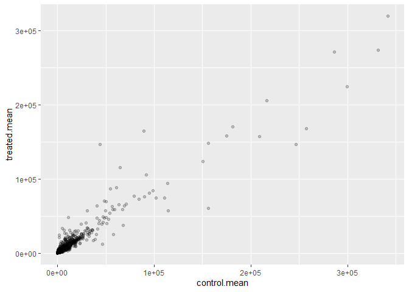
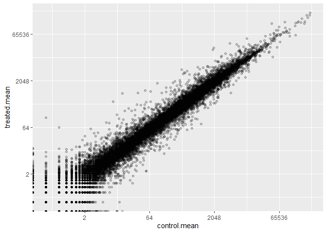
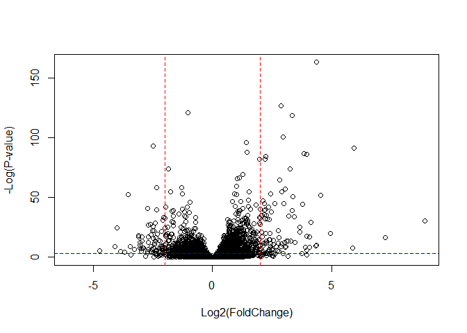

# Class 13: Transcriptomics and the analysis of RNA-Seq data
Yufei Liu (A16222438)

Today we will examine data from a published RNA-seq experiment where
airway smooth muscle cells were treated with *dexamethasone (dex)*, a
synthetic glucocorticoid steroid with anti-inflammatory effects (Himes
et al. 2014).

# Import countData and colData

``` r
counts <- read.csv("airway_scaledcounts.csv", row.names=1)
metadata <-  read.csv("airway_metadata.csv")

head(counts)
```

                    SRR1039508 SRR1039509 SRR1039512 SRR1039513 SRR1039516
    ENSG00000000003        723        486        904        445       1170
    ENSG00000000005          0          0          0          0          0
    ENSG00000000419        467        523        616        371        582
    ENSG00000000457        347        258        364        237        318
    ENSG00000000460         96         81         73         66        118
    ENSG00000000938          0          0          1          0          2
                    SRR1039517 SRR1039520 SRR1039521
    ENSG00000000003       1097        806        604
    ENSG00000000005          0          0          0
    ENSG00000000419        781        417        509
    ENSG00000000457        447        330        324
    ENSG00000000460         94        102         74
    ENSG00000000938          0          0          0

``` r
head(metadata)
```

              id     dex celltype     geo_id
    1 SRR1039508 control   N61311 GSM1275862
    2 SRR1039509 treated   N61311 GSM1275863
    3 SRR1039512 control  N052611 GSM1275866
    4 SRR1039513 treated  N052611 GSM1275867
    5 SRR1039516 control  N080611 GSM1275870
    6 SRR1039517 treated  N080611 GSM1275871

**Q1.** How many genes are in this dataset?

``` r
nrow(counts)
```

    [1] 38694

**Q2.** How many ‘control’ cell lines do we have?

``` r
sum(metadata$dex == "control")
```

    [1] 4

# Toy differential gene expression

Lets perform some exploratory differential gene expression analysis.
**Note: this analysis is for demonstration only. NEVER do differential
expression analysis this way!**

We want to calculate the mean of all control and treated cell lines
respectively for each gene.

``` r
library(dplyr)
```

    Warning: 程辑包'dplyr'是用R版本4.3.1 来建造的


    载入程辑包：'dplyr'

    The following objects are masked from 'package:stats':

        filter, lag

    The following objects are masked from 'package:base':

        intersect, setdiff, setequal, union

``` r
#Find which columns in "counts" correspond to control samples
control.inds <- metadata %>% filter(dex=="control")
control.counts <- counts %>% select(control.inds$id) 
# Calculate the mean value of control samples for each cell line, store in "control.mean" 
control.mean <- rowSums(control.counts)/4
head(control.mean)
```

    ENSG00000000003 ENSG00000000005 ENSG00000000419 ENSG00000000457 ENSG00000000460 
             900.75            0.00          520.50          339.75           97.25 
    ENSG00000000938 
               0.75 

**Q3.** How would you make the above code more robust? Is there a
function that could help here?

``` r
#1: apply(control.counts,1,mean)
#2: rowMeans(control.counts)
control.mean <- rowMeans(control.counts)
head(control.mean)
```

    ENSG00000000003 ENSG00000000005 ENSG00000000419 ENSG00000000457 ENSG00000000460 
             900.75            0.00          520.50          339.75           97.25 
    ENSG00000000938 
               0.75 

**Q4.** Follow the same procedure for the treated samples
(i.e. calculate the mean per gene across drug treated samples and assign
to a labeled vector called treated.mean)

``` r
treated.inds <- metadata %>% filter(dex=="treated")
treated.mean <- rowMeans(counts %>% select(treated.inds$id))
head(treated.mean)
```

    ENSG00000000003 ENSG00000000005 ENSG00000000419 ENSG00000000457 ENSG00000000460 
             658.00            0.00          546.00          316.50           78.75 
    ENSG00000000938 
               0.00 

We will combine the control and treated data to a dataframe.

``` r
counts.mean <- data.frame(control.mean, treated.mean)
head(counts.mean)
```

                    control.mean treated.mean
    ENSG00000000003       900.75       658.00
    ENSG00000000005         0.00         0.00
    ENSG00000000419       520.50       546.00
    ENSG00000000457       339.75       316.50
    ENSG00000000460        97.25        78.75
    ENSG00000000938         0.75         0.00

We can try to compare the control and treated mean value:

``` r
colSums(counts.mean)
```

    control.mean treated.mean 
        23005324     22196524 

This doesn’t make a lot of sense. We can try to visualize the data:

**Q5 (a).** Create a scatter plot showing the mean of the treated
samples against the mean of the control samples. Your plot should look
something like the following.

``` r
plot(counts.mean, xlab="Control", ylab="Treated")
```


**Q5 (b).** You could also use the ggplot2 package to make this figure
producing the plot below. What geom\_?() function would you use for this
plot?

``` r
library(ggplot2)
```

    Warning: 程辑包'ggplot2'是用R版本4.3.1 来建造的

``` r
ggplot(counts.mean, aes(control.mean, treated.mean)) + geom_point(alpha = 0.2)
```



We want to transform the data representation to log scale to better
visualize the points.

**Q6.** Try plotting both axes on a log scale.

``` r
ggplot(counts.mean, aes(control.mean, treated.mean)) + 
  geom_point(alpha = 0.2) +
  scale_x_continuous(trans="log2") +
  scale_y_continuous(trans="log2")
```

    Warning: Transformation introduced infinite values in continuous x-axis

    Warning: Transformation introduced infinite values in continuous y-axis



Making sense of log scale:

``` r
#if no change: 0
log2(10/10)
```

    [1] 0

``` r
# if doubled: 1
log2(20/10)
```

    [1] 1

``` r
# if halfed: -1
log2(5/10)
```

    [1] -1

``` r
# if quadrapled: 2
log2(40/10)
```

    [1] 2

We can find candidate differentially expressed genes by looking for
genes with a large change between control and dex-treated samples, by
looking at the fold changes (log2fc)

``` r
counts.mean$log2fc <- log2(counts.mean[,"treated.mean"]/counts.mean[,"control.mean"])

head(counts.mean)
```

                    control.mean treated.mean      log2fc
    ENSG00000000003       900.75       658.00 -0.45303916
    ENSG00000000005         0.00         0.00         NaN
    ENSG00000000419       520.50       546.00  0.06900279
    ENSG00000000457       339.75       316.50 -0.10226805
    ENSG00000000460        97.25        78.75 -0.30441833
    ENSG00000000938         0.75         0.00        -Inf

There are a couple of “weird” results: The NaN (“not a number”) is
returned when you divide by zero and try to take the log; and the -Inf
(negative infinity) is returned when you try to take the log of zero.

We want to filter out genes that have no expression.

Approach1

``` r
# Find rows to remove: with more than 1 value 0
to.rm.inds <- rowSums(counts.mean[,1:2] == 0) >0
# Remove by flipping the TRUE and FALSE values
mycounts <- counts.mean[!to.rm.inds,]
head(mycounts)
```

                    control.mean treated.mean      log2fc
    ENSG00000000003       900.75       658.00 -0.45303916
    ENSG00000000419       520.50       546.00  0.06900279
    ENSG00000000457       339.75       316.50 -0.10226805
    ENSG00000000460        97.25        78.75 -0.30441833
    ENSG00000000971      5219.00      6687.50  0.35769358
    ENSG00000001036      2327.00      1785.75 -0.38194109

``` r
dim(mycounts)
```

    [1] 21817     3

Approach 2: dplyr

``` r
mycounts <- counts.mean %>% filter (control.mean != 0, treated.mean !=0)
head (mycounts)
```

                    control.mean treated.mean      log2fc
    ENSG00000000003       900.75       658.00 -0.45303916
    ENSG00000000419       520.50       546.00  0.06900279
    ENSG00000000457       339.75       316.50 -0.10226805
    ENSG00000000460        97.25        78.75 -0.30441833
    ENSG00000000971      5219.00      6687.50  0.35769358
    ENSG00000001036      2327.00      1785.75 -0.38194109

``` r
dim(mycounts)
```

    [1] 21817     3

Approach 3

``` r
zero.vals <- which(counts.mean[,1:2]==0, arr.ind=TRUE)

to.rm <- unique(zero.vals[,1])
mycounts <- counts.mean[-to.rm,]
head(mycounts)
```

                    control.mean treated.mean      log2fc
    ENSG00000000003       900.75       658.00 -0.45303916
    ENSG00000000419       520.50       546.00  0.06900279
    ENSG00000000457       339.75       316.50 -0.10226805
    ENSG00000000460        97.25        78.75 -0.30441833
    ENSG00000000971      5219.00      6687.50  0.35769358
    ENSG00000001036      2327.00      1785.75 -0.38194109

**Q7.** What is the purpose of the arr.ind argument in the which()
function call above? Why would we then take the first column of the
output and need to call the unique() function? arr.ind tells it to
return the row and column indices of the matches as a matrix, rather
than just a vector of indices We need to subset out the unique row
numbers (unique(zero.vals\[,1\])) that contain a 0 in those columns

A common threshold used for calling something differentially expressed
is a log2(FoldChange) of greater than 2 or less than -2. Let’s filter
the dataset both ways to see how many genes are up or down-regulated.

``` r
up.ind <- mycounts$log2fc > 2
down.ind <- mycounts$log2fc < (-2)
```

**Q8.** Using the up.ind vector above can you determine how many up
regulated genes we have at the greater than 2 fc level?

``` r
sum(up.ind)
```

    [1] 250

**Q9** Using the down.ind vector above can you determine how many down
regulated genes we have at the greater than 2 fc level?

``` r
sum(down.ind)
```

    [1] 367

**Q10.** Do you trust these results? Why or why not? No. We don’t know
if the change is statistically significant.

# Using DESeq2

``` r
library(DESeq2)
```

    Warning: 程辑包'DESeq2'是用R版本4.3.1 来建造的

    载入需要的程辑包：S4Vectors

    Warning: 程辑包'S4Vectors'是用R版本4.3.1 来建造的

    载入需要的程辑包：stats4

    载入需要的程辑包：BiocGenerics

    Warning: 程辑包'BiocGenerics'是用R版本4.3.1 来建造的


    载入程辑包：'BiocGenerics'

    The following objects are masked from 'package:dplyr':

        combine, intersect, setdiff, union

    The following objects are masked from 'package:stats':

        IQR, mad, sd, var, xtabs

    The following objects are masked from 'package:base':

        anyDuplicated, aperm, append, as.data.frame, basename, cbind,
        colnames, dirname, do.call, duplicated, eval, evalq, Filter, Find,
        get, grep, grepl, intersect, is.unsorted, lapply, Map, mapply,
        match, mget, order, paste, pmax, pmax.int, pmin, pmin.int,
        Position, rank, rbind, Reduce, rownames, sapply, setdiff, sort,
        table, tapply, union, unique, unsplit, which.max, which.min


    载入程辑包：'S4Vectors'

    The following objects are masked from 'package:dplyr':

        first, rename

    The following object is masked from 'package:utils':

        findMatches

    The following objects are masked from 'package:base':

        expand.grid, I, unname

    载入需要的程辑包：IRanges

    Warning: 程辑包'IRanges'是用R版本4.3.1 来建造的


    载入程辑包：'IRanges'

    The following objects are masked from 'package:dplyr':

        collapse, desc, slice

    The following object is masked from 'package:grDevices':

        windows

    载入需要的程辑包：GenomicRanges

    Warning: 程辑包'GenomicRanges'是用R版本4.3.1 来建造的

    载入需要的程辑包：GenomeInfoDb

    Warning: 程辑包'GenomeInfoDb'是用R版本4.3.1 来建造的

    载入需要的程辑包：SummarizedExperiment

    Warning: 程辑包'SummarizedExperiment'是用R版本4.3.1 来建造的

    载入需要的程辑包：MatrixGenerics

    Warning: 程辑包'MatrixGenerics'是用R版本4.3.1 来建造的

    载入需要的程辑包：matrixStats

    Warning: 程辑包'matrixStats'是用R版本4.3.2 来建造的


    载入程辑包：'matrixStats'

    The following object is masked from 'package:dplyr':

        count


    载入程辑包：'MatrixGenerics'

    The following objects are masked from 'package:matrixStats':

        colAlls, colAnyNAs, colAnys, colAvgsPerRowSet, colCollapse,
        colCounts, colCummaxs, colCummins, colCumprods, colCumsums,
        colDiffs, colIQRDiffs, colIQRs, colLogSumExps, colMadDiffs,
        colMads, colMaxs, colMeans2, colMedians, colMins, colOrderStats,
        colProds, colQuantiles, colRanges, colRanks, colSdDiffs, colSds,
        colSums2, colTabulates, colVarDiffs, colVars, colWeightedMads,
        colWeightedMeans, colWeightedMedians, colWeightedSds,
        colWeightedVars, rowAlls, rowAnyNAs, rowAnys, rowAvgsPerColSet,
        rowCollapse, rowCounts, rowCummaxs, rowCummins, rowCumprods,
        rowCumsums, rowDiffs, rowIQRDiffs, rowIQRs, rowLogSumExps,
        rowMadDiffs, rowMads, rowMaxs, rowMeans2, rowMedians, rowMins,
        rowOrderStats, rowProds, rowQuantiles, rowRanges, rowRanks,
        rowSdDiffs, rowSds, rowSums2, rowTabulates, rowVarDiffs, rowVars,
        rowWeightedMads, rowWeightedMeans, rowWeightedMedians,
        rowWeightedSds, rowWeightedVars

    载入需要的程辑包：Biobase

    Warning: 程辑包'Biobase'是用R版本4.3.1 来建造的

    Welcome to Bioconductor

        Vignettes contain introductory material; view with
        'browseVignettes()'. To cite Bioconductor, see
        'citation("Biobase")', and for packages 'citation("pkgname")'.


    载入程辑包：'Biobase'

    The following object is masked from 'package:MatrixGenerics':

        rowMedians

    The following objects are masked from 'package:matrixStats':

        anyMissing, rowMedians

``` r
dds <- DESeqDataSetFromMatrix(countData= counts,
                              colData= metadata,
                              design = ~dex)
```

    converting counts to integer mode

    Warning in DESeqDataSet(se, design = design, ignoreRank): some variables in
    design formula are characters, converting to factors

``` r
dds
```

    class: DESeqDataSet 
    dim: 38694 8 
    metadata(1): version
    assays(1): counts
    rownames(38694): ENSG00000000003 ENSG00000000005 ... ENSG00000283120
      ENSG00000283123
    rowData names(0):
    colnames(8): SRR1039508 SRR1039509 ... SRR1039520 SRR1039521
    colData names(4): id dex celltype geo_id

Get our results back from the dds object

``` r
dds <- DESeq(dds)
```

    estimating size factors

    estimating dispersions

    gene-wise dispersion estimates

    mean-dispersion relationship

    final dispersion estimates

    fitting model and testing

``` r
res <- results (dds)
head(res)
```

    log2 fold change (MLE): dex treated vs control 
    Wald test p-value: dex treated vs control 
    DataFrame with 6 rows and 6 columns
                      baseMean log2FoldChange     lfcSE      stat    pvalue
                     <numeric>      <numeric> <numeric> <numeric> <numeric>
    ENSG00000000003 747.194195     -0.3507030  0.168246 -2.084470 0.0371175
    ENSG00000000005   0.000000             NA        NA        NA        NA
    ENSG00000000419 520.134160      0.2061078  0.101059  2.039475 0.0414026
    ENSG00000000457 322.664844      0.0245269  0.145145  0.168982 0.8658106
    ENSG00000000460  87.682625     -0.1471420  0.257007 -0.572521 0.5669691
    ENSG00000000938   0.319167     -1.7322890  3.493601 -0.495846 0.6200029
                         padj
                    <numeric>
    ENSG00000000003  0.163035
    ENSG00000000005        NA
    ENSG00000000419  0.176032
    ENSG00000000457  0.961694
    ENSG00000000460  0.815849
    ENSG00000000938        NA

# Summary result plot

Volcano plot

This is a common type of summary figure to show both log2fc and pvalue
(adjusted)

``` r
# use -log for pvalue for easier interpretation: the points with large fc and with low p value are on the top
plot( res$log2FoldChange,  -log(res$padj), 
      xlab="Log2(FoldChange)",
      ylab="-Log(P-value)")
```


To make this more useful we can add some guidelines (with the abline()
function) and color (with a custom color vector) highlighting genes that
have padj\<0.05 and the absolute log2FoldChange\>2.

``` r
plot( res$log2FoldChange,  -log(res$padj), 
 ylab="-Log(P-value)", xlab="Log2(FoldChange)")

# Add some cut-off lines
abline(v=c(-2,2), col="red", lty=2)
abline(h=-log(0.05), col="blue", lty=2)
```



Try to make a prettier version with significantly changed genes in blue
and changed but not significant in red.

``` r
# Setup our custom point color vector 
mycols <- rep("gray", nrow(res))
mycols[ abs(res$log2FoldChange) > 2 ]  <- "red" 

inds <- (res$padj < 0.01) & (abs(res$log2FoldChange) > 2 )
mycols[ inds ] <- "blue"

# Volcano plot with custom colors 
plot( res$log2FoldChange,  -log(res$padj), 
 col=mycols, ylab="-Log(P-value)", xlab="Log2(FoldChange)" )

# Cut-off lines
abline(v=c(-2,2), col="gray", lty=2)
abline(h=-log(0.1), col="gray", lty=2)
```


Save our results

``` r
write.csv(res, file = "deseq_results.csv")
```

# Adding annotation

Our result table so far only contains the Ensembl gene IDs. However,
alternative gene names and extra annotation are usually required for
informative interpretation of our results. In this section we will add
this necessary annotation data to our results.

We will use one of Bioconductor’s main annotation packages to help with
mapping between various ID schemes. Here we load the AnnotationDbi
package and the annotation data package for humans org.Hs.eg.db.

``` r
library("AnnotationDbi")
```

    Warning: 程辑包'AnnotationDbi'是用R版本4.3.2 来建造的


    载入程辑包：'AnnotationDbi'

    The following object is masked from 'package:dplyr':

        select

``` r
library("org.Hs.eg.db")
```

``` r
columns(org.Hs.eg.db)
```

     [1] "ACCNUM"       "ALIAS"        "ENSEMBL"      "ENSEMBLPROT"  "ENSEMBLTRANS"
     [6] "ENTREZID"     "ENZYME"       "EVIDENCE"     "EVIDENCEALL"  "GENENAME"    
    [11] "GENETYPE"     "GO"           "GOALL"        "IPI"          "MAP"         
    [16] "OMIM"         "ONTOLOGY"     "ONTOLOGYALL"  "PATH"         "PFAM"        
    [21] "PMID"         "PROSITE"      "REFSEQ"       "SYMBOL"       "UCSCKG"      
    [26] "UNIPROT"     

The main function we will use here is called `mapIDs()`.

Our current IDs are:

``` r
head(row.names(res))
```

    [1] "ENSG00000000003" "ENSG00000000005" "ENSG00000000419" "ENSG00000000457"
    [5] "ENSG00000000460" "ENSG00000000938"

These are in Ensemble format. We want to know the “SYMBOL” ids

``` r
res$symbol <- mapIds(org.Hs.eg.db, 
                     #Our symbol
                     keys = row.names(res),
                     keytype = "ENSEMBL",
                     # target symbol
                     column = "SYMBOL",
                     # if multiple values appear
                     multivals = "first")
```

    'select()' returned 1:many mapping between keys and columns

``` r
head(res)
```

    log2 fold change (MLE): dex treated vs control 
    Wald test p-value: dex treated vs control 
    DataFrame with 6 rows and 7 columns
                      baseMean log2FoldChange     lfcSE      stat    pvalue
                     <numeric>      <numeric> <numeric> <numeric> <numeric>
    ENSG00000000003 747.194195     -0.3507030  0.168246 -2.084470 0.0371175
    ENSG00000000005   0.000000             NA        NA        NA        NA
    ENSG00000000419 520.134160      0.2061078  0.101059  2.039475 0.0414026
    ENSG00000000457 322.664844      0.0245269  0.145145  0.168982 0.8658106
    ENSG00000000460  87.682625     -0.1471420  0.257007 -0.572521 0.5669691
    ENSG00000000938   0.319167     -1.7322890  3.493601 -0.495846 0.6200029
                         padj      symbol
                    <numeric> <character>
    ENSG00000000003  0.163035      TSPAN6
    ENSG00000000005        NA        TNMD
    ENSG00000000419  0.176032        DPM1
    ENSG00000000457  0.961694       SCYL3
    ENSG00000000460  0.815849       FIRRM
    ENSG00000000938        NA         FGR

**Q11.** Run the mapIds() function two more times to add the Entrez ID
and UniProt accession and GENENAME as new columns called `res$entrez`,
`res$uniprot` and `res$genename`

``` r
res$genename <- mapIds(org.Hs.eg.db, 
                     #Our symbol
                     keys = row.names(res),
                     keytype = "ENSEMBL",
                     # target symbol
                     column = "GENENAME",
                     # if multiple values appear
                     multivals = "first")
```

    'select()' returned 1:many mapping between keys and columns

``` r
res$uniprot <- mapIds(org.Hs.eg.db, 
                     #Our symbol
                     keys = row.names(res),
                     keytype = "ENSEMBL",
                     # target symbol
                     column = "UNIPROT",
                     # if multiple values appear
                     multivals = "first")
```

    'select()' returned 1:many mapping between keys and columns

``` r
res$entrez <- mapIds(org.Hs.eg.db, 
                     #Our symbol
                     keys = row.names(res),
                     keytype = "ENSEMBL",
                     # target symbol
                     column = "ENTREZID",
                     # if multiple values appear
                     multivals = "first")
```

    'select()' returned 1:many mapping between keys and columns

``` r
head(res)
```

    log2 fold change (MLE): dex treated vs control 
    Wald test p-value: dex treated vs control 
    DataFrame with 6 rows and 10 columns
                      baseMean log2FoldChange     lfcSE      stat    pvalue
                     <numeric>      <numeric> <numeric> <numeric> <numeric>
    ENSG00000000003 747.194195     -0.3507030  0.168246 -2.084470 0.0371175
    ENSG00000000005   0.000000             NA        NA        NA        NA
    ENSG00000000419 520.134160      0.2061078  0.101059  2.039475 0.0414026
    ENSG00000000457 322.664844      0.0245269  0.145145  0.168982 0.8658106
    ENSG00000000460  87.682625     -0.1471420  0.257007 -0.572521 0.5669691
    ENSG00000000938   0.319167     -1.7322890  3.493601 -0.495846 0.6200029
                         padj      symbol               genename     uniprot
                    <numeric> <character>            <character> <character>
    ENSG00000000003  0.163035      TSPAN6          tetraspanin 6  A0A024RCI0
    ENSG00000000005        NA        TNMD            tenomodulin      Q9H2S6
    ENSG00000000419  0.176032        DPM1 dolichyl-phosphate m..      O60762
    ENSG00000000457  0.961694       SCYL3 SCY1 like pseudokina..      Q8IZE3
    ENSG00000000460  0.815849       FIRRM FIGNL1 interacting r..  A0A024R922
    ENSG00000000938        NA         FGR FGR proto-oncogene, ..      P09769
                         entrez
                    <character>
    ENSG00000000003        7105
    ENSG00000000005       64102
    ENSG00000000419        8813
    ENSG00000000457       57147
    ENSG00000000460       55732
    ENSG00000000938        2268

# Pathway analysis

We will use the **gage** package along with **pathview** here to do
geneset enrichment (a.k.a pathway analysis) and figure generation
respectively.

``` r
library(pathview)
```

    Warning: 程辑包'pathview'是用R版本4.3.1 来建造的

    ##############################################################################
    Pathview is an open source software package distributed under GNU General
    Public License version 3 (GPLv3). Details of GPLv3 is available at
    http://www.gnu.org/licenses/gpl-3.0.html. Particullary, users are required to
    formally cite the original Pathview paper (not just mention it) in publications
    or products. For details, do citation("pathview") within R.

    The pathview downloads and uses KEGG data. Non-academic uses may require a KEGG
    license agreement (details at http://www.kegg.jp/kegg/legal.html).
    ##############################################################################

``` r
library (gage)
```

    Warning: 程辑包'gage'是用R版本4.3.1 来建造的

``` r
library (gageData)
```

``` r
data(kegg.sets.hs)

# Examine the first 2 pathways in this kegg set for humans
head(kegg.sets.hs, 2)
```

    $`hsa00232 Caffeine metabolism`
    [1] "10"   "1544" "1548" "1549" "1553" "7498" "9"   

    $`hsa00983 Drug metabolism - other enzymes`
     [1] "10"     "1066"   "10720"  "10941"  "151531" "1548"   "1549"   "1551"  
     [9] "1553"   "1576"   "1577"   "1806"   "1807"   "1890"   "221223" "2990"  
    [17] "3251"   "3614"   "3615"   "3704"   "51733"  "54490"  "54575"  "54576" 
    [25] "54577"  "54578"  "54579"  "54600"  "54657"  "54658"  "54659"  "54963" 
    [33] "574537" "64816"  "7083"   "7084"   "7172"   "7363"   "7364"   "7365"  
    [41] "7366"   "7367"   "7371"   "7372"   "7378"   "7498"   "79799"  "83549" 
    [49] "8824"   "8833"   "9"      "978"   

What we need for `gage()` is our genes in ENTREZ id format with a
measure of their importance

It wants a vector of e.g. fold-changes.

``` r
foldchanges <- res$log2FoldChange
head(foldchanges)
```

    [1] -0.35070302          NA  0.20610777  0.02452695 -0.14714205 -1.73228897

We want to add identifier (ENTREZ id) to the foldchanges

``` r
names(foldchanges) <- res$entrez
head(foldchanges)
```

           7105       64102        8813       57147       55732        2268 
    -0.35070302          NA  0.20610777  0.02452695 -0.14714205 -1.73228897 

Now we can run `gage()` with this input vector and the genset we want to
examine with.

``` r
# Get the results
keggres = gage(foldchanges, gsets=kegg.sets.hs)

attributes(keggres)
```

    $names
    [1] "greater" "less"    "stats"  

Lets look at the first few down (less) pathway results:

``` r
# Look at the first three down (less) pathways
head(keggres$less, 3)
```

                                          p.geomean stat.mean        p.val
    hsa05332 Graft-versus-host disease 0.0004250461 -3.473346 0.0004250461
    hsa04940 Type I diabetes mellitus  0.0017820293 -3.002352 0.0017820293
    hsa05310 Asthma                    0.0020045888 -3.009050 0.0020045888
                                            q.val set.size         exp1
    hsa05332 Graft-versus-host disease 0.09053483       40 0.0004250461
    hsa04940 Type I diabetes mellitus  0.14232581       42 0.0017820293
    hsa05310 Asthma                    0.14232581       29 0.0020045888

Let’s try out the pathview() function from the pathview package to make
a pathway plot with our RNA-Seq expression results shown in color.

e.g. for AsthmaI, we will use pathway.id hsa05310 as seen above.

``` r
pathview(gene.data=foldchanges, pathway.id="hsa05310")
```

    'select()' returned 1:1 mapping between keys and columns

    Info: Working in directory D:/RStudio_BIMM143/BIMM143_github/class13

    Info: Writing image file hsa05310.pathview.png

 **Q12.**
Can you do the same procedure as above to plot the pathview figures for
the top 2 down-reguled pathways?

``` r
pathview(gene.data=foldchanges, pathway.id="hsa05332")
```

    'select()' returned 1:1 mapping between keys and columns

    Info: Working in directory D:/RStudio_BIMM143/BIMM143_github/class13

    Info: Writing image file hsa05332.pathview.png

``` r
pathview(gene.data=foldchanges, pathway.id="hsa04940")
```

    'select()' returned 1:1 mapping between keys and columns

    Info: Working in directory D:/RStudio_BIMM143/BIMM143_github/class13

    Info: Writing image file hsa04940.pathview.png


