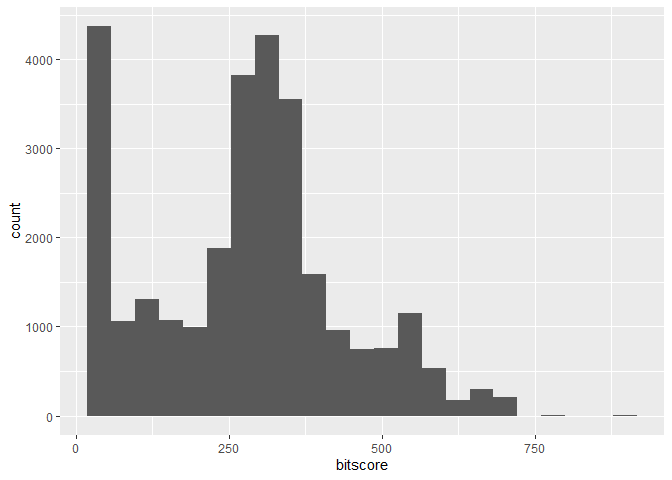
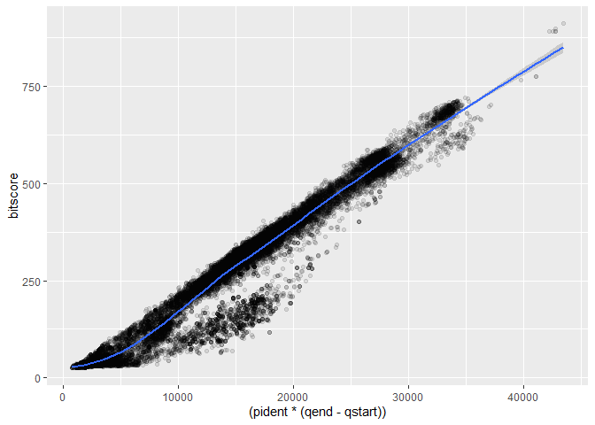
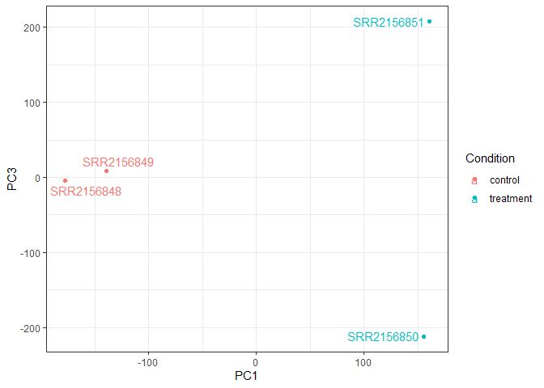
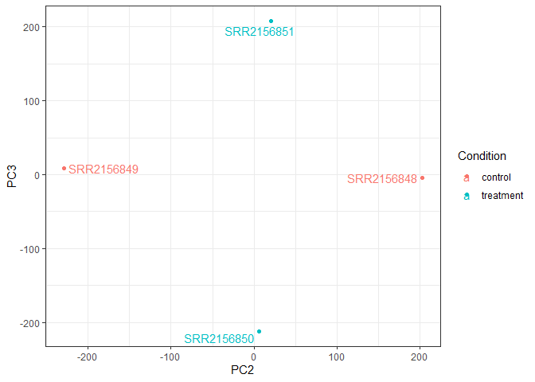
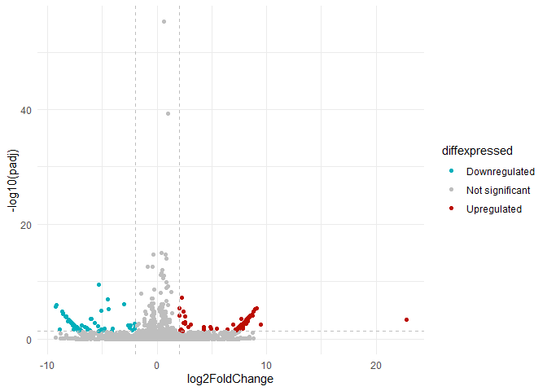

# class18
Yufei (A16222438)

# 1. Class 17 output

Read blast result downloaded from the remote computer

``` r
b <- read.table("mm-second.x.zebrafish.tsv", sep = "\t")
colnames(b) <- c("qseqid", "sseqid", "pident", "length", "mismatch", "gapopen", "qstart", "qend", "sstart", "send", "evalue", "bitscore")
head (b)
```

           qseqid         sseqid pident length mismatch gapopen qstart qend sstart
    1 NP_598866.1 XP_009294521.1 46.154    273      130       6      4  267    420
    2 NP_598866.1 NP_001313634.1 46.154    273      130       6      4  267    476
    3 NP_598866.1 XP_009294513.1 46.154    273      130       6      4  267    475
    4 NP_598866.1 NP_001186666.1 33.071    127       76       5      4  126    338
    5 NP_598866.1 NP_001003517.1 30.400    125       82       4      4  126    344
    6 NP_598866.1 NP_001003517.1 30.645     62       41       2     53  113     43
      send   evalue bitscore
    1  684 1.70e-63    214.0
    2  740 4.51e-63    214.0
    3  739 4.69e-63    214.0
    4  459 5.19e-12     67.8
    5  465 2.67e-11     65.5
    6  103 4.40e-01     33.9

Make a histogram of the \$bitscore values.

``` r
library(ggplot2)
```

    Warning: 程辑包'ggplot2'是用R版本4.3.1 来建造的

``` r
ggplot(b,aes(bitscore)) + geom_histogram(binwidth = 39)
```



The distribution of bitscore is bimodal, with a peak around 0 and
another around 300.

Relationship between **percent identity** \* **sequence length** and
**bitscore** for the alignments we generated?

``` r
ggplot(b, aes((pident * (qend - qstart)), bitscore)) + geom_point(alpha=0.1) + geom_smooth(method = "gam", formula = y ~ s(x, bs = "cs"))
```



\#2 Class18: Transcript Analysis

We’ve imported the transcripts from remote computers to local project
folder. With each sample having its own directory containing the
Kallisto output, we can import the transcript count estimates into R
using:

``` r
library(tximport)
```

    Warning: 程辑包'tximport'是用R版本4.3.1 来建造的

``` r
library (rhdf5)
```

    Warning: 程辑包'rhdf5'是用R版本4.3.2 来建造的

``` r
# setup the folder and filenames to read
folders <- dir(pattern="SRR21568*")
samples <- sub("_quant", "", folders)
files <- file.path( folders, "abundance.h5" )
names(files) <- samples

txi.kallisto <- tximport(files, type = "kallisto", txOut = TRUE)
```

    1 2 3 4 

``` r
# inspect the imported results
head(txi.kallisto$counts)
```

                    SRR2156848 SRR2156849 SRR2156850 SRR2156851
    ENST00000539570          0          0    0.00000          0
    ENST00000576455          0          0    2.62037          0
    ENST00000510508          0          0    0.00000          0
    ENST00000474471          0          1    1.00000          0
    ENST00000381700          0          0    0.00000          0
    ENST00000445946          0          0    0.00000          0

``` r
# see how many transcripts we have for each sample
colSums(txi.kallisto$counts)
```

    SRR2156848 SRR2156849 SRR2156850 SRR2156851 
       2563611    2600800    2372309    2111474 

``` r
# how many transcripts are detected in at least one sample
sum(rowSums(txi.kallisto$counts)>0)
```

    [1] 94561

Before subsequent analysis, we might want to filter out those annotated
transcripts with no reads:

``` r
to.keep <- rowSums(txi.kallisto$counts) > 0
kset.nonzero <- txi.kallisto$counts[to.keep,]
```

And also filter out those with no change over samples:

``` r
keep2 <- apply(kset.nonzero,1,sd)>0
x <- kset.nonzero[keep2,]
```

## PCA

Now we can perform PCA analysis.

``` r
pca <- prcomp(t(x), scale=TRUE)
summary(pca)
```

    Importance of components:
                                PC1      PC2      PC3   PC4
    Standard deviation     183.6379 177.3605 171.3020 1e+00
    Proportion of Variance   0.3568   0.3328   0.3104 1e-05
    Cumulative Proportion    0.3568   0.6895   1.0000 1e+00

Now we can use the PCs as a co-ordinate system for visualizing the
summarized transcriptomic profiles of each sample:

``` r
library(ggrepel)
```

    Warning: 程辑包'ggrepel'是用R版本4.3.1 来建造的

``` r
# Make metadata object for the samples
colData <- data.frame(condition = factor(rep(c("control", "treatment"), each = 2)))
rownames(colData) <- colnames(txi.kallisto$counts)

# Make the data.frame for ggplot 
y <- as.data.frame(pca$x)
y$Condition <- as.factor(colData$condition)

ggplot(y) +
  aes(PC1, PC2, col=Condition) +
  geom_point() +
  geom_text_repel(label=rownames(y)) +
  theme_bw()
```


Make PC1 vs 3, 2 vs 3

``` r
ggplot(y) +
  aes(PC1, PC3, col=Condition) +
  geom_point() +
  geom_text_repel(label=rownames(y)) +
  theme_bw()
```



``` r
ggplot(y) +
  aes(PC2, PC3, col=Condition) +
  geom_point() +
  geom_text_repel(label=rownames(y)) +
  theme_bw()
```



PC1 separates control from treatment, PC2 separates the two controls,
and PC3 separates the two treatments.

## Differential-expression

We can also use DESeq2 to complete the differential-expression analysis.
First we need to create a DESeqDataSet for use:

``` r
library(DESeq2)
```

    Warning: 程辑包'DESeq2'是用R版本4.3.1 来建造的

    载入需要的程辑包：S4Vectors

    Warning: 程辑包'S4Vectors'是用R版本4.3.1 来建造的

    载入需要的程辑包：stats4

    载入需要的程辑包：BiocGenerics

    Warning: 程辑包'BiocGenerics'是用R版本4.3.1 来建造的


    载入程辑包：'BiocGenerics'

    The following objects are masked from 'package:stats':

        IQR, mad, sd, var, xtabs

    The following objects are masked from 'package:base':

        anyDuplicated, aperm, append, as.data.frame, basename, cbind,
        colnames, dirname, do.call, duplicated, eval, evalq, Filter, Find,
        get, grep, grepl, intersect, is.unsorted, lapply, Map, mapply,
        match, mget, order, paste, pmax, pmax.int, pmin, pmin.int,
        Position, rank, rbind, Reduce, rownames, sapply, setdiff, sort,
        table, tapply, union, unique, unsplit, which.max, which.min


    载入程辑包：'S4Vectors'

    The following object is masked from 'package:utils':

        findMatches

    The following objects are masked from 'package:base':

        expand.grid, I, unname

    载入需要的程辑包：IRanges

    Warning: 程辑包'IRanges'是用R版本4.3.1 来建造的


    载入程辑包：'IRanges'

    The following object is masked from 'package:grDevices':

        windows

    载入需要的程辑包：GenomicRanges

    Warning: 程辑包'GenomicRanges'是用R版本4.3.1 来建造的

    载入需要的程辑包：GenomeInfoDb

    Warning: 程辑包'GenomeInfoDb'是用R版本4.3.1 来建造的

    载入需要的程辑包：SummarizedExperiment

    Warning: 程辑包'SummarizedExperiment'是用R版本4.3.1 来建造的

    载入需要的程辑包：MatrixGenerics

    Warning: 程辑包'MatrixGenerics'是用R版本4.3.1 来建造的

    载入需要的程辑包：matrixStats

    Warning: 程辑包'matrixStats'是用R版本4.3.2 来建造的


    载入程辑包：'MatrixGenerics'

    The following objects are masked from 'package:matrixStats':

        colAlls, colAnyNAs, colAnys, colAvgsPerRowSet, colCollapse,
        colCounts, colCummaxs, colCummins, colCumprods, colCumsums,
        colDiffs, colIQRDiffs, colIQRs, colLogSumExps, colMadDiffs,
        colMads, colMaxs, colMeans2, colMedians, colMins, colOrderStats,
        colProds, colQuantiles, colRanges, colRanks, colSdDiffs, colSds,
        colSums2, colTabulates, colVarDiffs, colVars, colWeightedMads,
        colWeightedMeans, colWeightedMedians, colWeightedSds,
        colWeightedVars, rowAlls, rowAnyNAs, rowAnys, rowAvgsPerColSet,
        rowCollapse, rowCounts, rowCummaxs, rowCummins, rowCumprods,
        rowCumsums, rowDiffs, rowIQRDiffs, rowIQRs, rowLogSumExps,
        rowMadDiffs, rowMads, rowMaxs, rowMeans2, rowMedians, rowMins,
        rowOrderStats, rowProds, rowQuantiles, rowRanges, rowRanks,
        rowSdDiffs, rowSds, rowSums2, rowTabulates, rowVarDiffs, rowVars,
        rowWeightedMads, rowWeightedMeans, rowWeightedMedians,
        rowWeightedSds, rowWeightedVars

    载入需要的程辑包：Biobase

    Warning: 程辑包'Biobase'是用R版本4.3.1 来建造的

    Welcome to Bioconductor

        Vignettes contain introductory material; view with
        'browseVignettes()'. To cite Bioconductor, see
        'citation("Biobase")', and for packages 'citation("pkgname")'.


    载入程辑包：'Biobase'

    The following object is masked from 'package:MatrixGenerics':

        rowMedians

    The following objects are masked from 'package:matrixStats':

        anyMissing, rowMedians

``` r
sampleTable <- data.frame(condition = factor(rep(c("control", "treatment"), each = 2)))
rownames(sampleTable) <- colnames(txi.kallisto$counts)
dds <- DESeqDataSetFromTximport(txi.kallisto,
                                sampleTable, 
                                ~condition)
```

    using counts and average transcript lengths from tximport

``` r
dds <- DESeq(dds)
```

    estimating size factors

    using 'avgTxLength' from assays(dds), correcting for library size

    estimating dispersions

    gene-wise dispersion estimates

    mean-dispersion relationship

    -- note: fitType='parametric', but the dispersion trend was not well captured by the
       function: y = a/x + b, and a local regression fit was automatically substituted.
       specify fitType='local' or 'mean' to avoid this message next time.

    final dispersion estimates

    fitting model and testing

``` r
res <- results(dds)
head(res)
```

    log2 fold change (MLE): condition treatment vs control 
    Wald test p-value: condition treatment vs control 
    DataFrame with 6 rows and 6 columns
                     baseMean log2FoldChange     lfcSE      stat    pvalue
                    <numeric>      <numeric> <numeric> <numeric> <numeric>
    ENST00000539570  0.000000             NA        NA        NA        NA
    ENST00000576455  0.761453       3.155061   4.86052 0.6491203  0.516261
    ENST00000510508  0.000000             NA        NA        NA        NA
    ENST00000474471  0.484938       0.181923   4.24871 0.0428185  0.965846
    ENST00000381700  0.000000             NA        NA        NA        NA
    ENST00000445946  0.000000             NA        NA        NA        NA
                         padj
                    <numeric>
    ENST00000539570        NA
    ENST00000576455        NA
    ENST00000510508        NA
    ENST00000474471        NA
    ENST00000381700        NA
    ENST00000445946        NA

Visualizing the result with volcano plot.

``` r
res.df <- as.data.frame(res)
head(res.df)
```

                     baseMean log2FoldChange    lfcSE       stat    pvalue padj
    ENST00000539570 0.0000000             NA       NA         NA        NA   NA
    ENST00000576455 0.7614534      3.1550607 4.860518 0.64912027 0.5162606   NA
    ENST00000510508 0.0000000             NA       NA         NA        NA   NA
    ENST00000474471 0.4849381      0.1819234 4.248712 0.04281848 0.9658462   NA
    ENST00000381700 0.0000000             NA       NA         NA        NA   NA
    ENST00000445946 0.0000000             NA       NA         NA        NA   NA

``` r
#remove NA values
library(dplyr)
```

    Warning: 程辑包'dplyr'是用R版本4.3.1 来建造的


    载入程辑包：'dplyr'

    The following object is masked from 'package:Biobase':

        combine

    The following object is masked from 'package:matrixStats':

        count

    The following objects are masked from 'package:GenomicRanges':

        intersect, setdiff, union

    The following object is masked from 'package:GenomeInfoDb':

        intersect

    The following objects are masked from 'package:IRanges':

        collapse, desc, intersect, setdiff, slice, union

    The following objects are masked from 'package:S4Vectors':

        first, intersect, rename, setdiff, setequal, union

    The following objects are masked from 'package:BiocGenerics':

        combine, intersect, setdiff, union

    The following objects are masked from 'package:stats':

        filter, lag

    The following objects are masked from 'package:base':

        intersect, setdiff, setequal, union

``` r
res.df <- res.df %>% filter (is.na(log2FoldChange) != TRUE , is.na (padj) != TRUE)
head(res.df)
```

                       baseMean log2FoldChange      lfcSE        stat       pvalue
    ENST00000553856    7.878398     0.14351383 1.63316213  0.08787482 0.9299761668
    ENST00000558098   36.577590     1.13158264 0.83055750  1.36243745 0.1730598725
    ENST00000361390 3916.419167    -0.12214775 0.04621936 -2.64278312 0.0082227688
    ENST00000361453 3113.464960    -0.17039089 0.05647901 -3.01688887 0.0025538342
    ENST00000361624 9669.856951    -0.11857878 0.03373660 -3.51484036 0.0004400184
    ENST00000361739 4636.903285    -0.02155106 0.05085374 -0.42378524 0.6717224424
                          padj
    ENST00000553856 0.99998645
    ENST00000558098 0.99998645
    ENST00000361390 0.22819329
    ENST00000361453 0.10532352
    ENST00000361624 0.03093132
    ENST00000361739 0.99998645

``` r
#make a volcano plot with ggplot
res.df$diffexpressed <- "NO"
res.df$diffexpressed[res.df$log2FoldChange > 2 & res.df$padj < 0.05] <- "UP"
res.df$diffexpressed[res.df$log2FoldChange < -2 & res.df$padj < 0.05] <- "DOWN"

ggplot(res.df) + 
  aes(log2FoldChange, -log10(padj), col = diffexpressed) + 
  geom_point() +
  theme_minimal() +
     # Add dashed line
     geom_vline(xintercept = c(-2, 2), col = "gray", linetype = 'dashed') +
     geom_hline(yintercept = -log10(0.05), col = "gray", linetype = 'dashed') + 
     # to set the colours of our variable
     scale_color_manual(values = c("#00AFBB", "grey", "#bb0c00"),
                        labels = c("Downregulated", "Not significant", "Upregulated"))
```



We can also run pathway analysis

``` r
#add entrez id
library("AnnotationDbi")
```

    Warning: 程辑包'AnnotationDbi'是用R版本4.3.2 来建造的


    载入程辑包：'AnnotationDbi'

    The following object is masked from 'package:dplyr':

        select

``` r
library("org.Hs.eg.db")
```

``` r
res.df$entrez <- mapIds(org.Hs.eg.db,
  #Our symbol
  keys = row.names(res.df),
  keytype = "ENSEMBLTRANS",
  # target symbol
  column = "ENTREZID",
  # if multiple values appear
  multivals = "first")
```

    'select()' returned 1:many mapping between keys and columns

``` r
library(pathview)
```

    Warning: 程辑包'pathview'是用R版本4.3.1 来建造的

    ##############################################################################
    Pathview is an open source software package distributed under GNU General
    Public License version 3 (GPLv3). Details of GPLv3 is available at
    http://www.gnu.org/licenses/gpl-3.0.html. Particullary, users are required to
    formally cite the original Pathview paper (not just mention it) in publications
    or products. For details, do citation("pathview") within R.

    The pathview downloads and uses KEGG data. Non-academic uses may require a KEGG
    license agreement (details at http://www.kegg.jp/kegg/legal.html).
    ##############################################################################

``` r
library(gage)
```

    Warning: 程辑包'gage'是用R版本4.3.1 来建造的

``` r
library(gageData)
data(kegg.sets.hs)
data(sigmet.idx.hs)

foldchanges = res.df$log2FoldChange
names(foldchanges) = res.df$entrez
head(foldchanges)
```

           <NA>        <NA>        4535        4536        4512        4513 
     0.14351383  1.13158264 -0.12214775 -0.17039089 -0.11857878 -0.02155106 

``` r
keggres = gage(foldchanges, gsets=kegg.sets.hs)
attributes(keggres)
```

    $names
    [1] "greater" "less"    "stats"  

``` r
# Look at the first few down (less) pathways
head(keggres$less)
```

                                                 p.geomean  stat.mean     p.val
    hsa05145 Toxoplasmosis                       0.2096127 -0.8247816 0.2096127
    hsa03040 Spliceosome                         0.2106510 -0.8141468 0.2106510
    hsa04612 Antigen processing and presentation 0.2269258 -0.7639008 0.2269258
    hsa04910 Insulin signaling pathway           0.2274629 -0.7554846 0.2274629
    hsa05016 Huntington's disease                0.2503638 -0.6813540 0.2503638
    hsa00190 Oxidative phosphorylation           0.2661034 -0.6307011 0.2661034
                                                     q.val set.size      exp1
    hsa05145 Toxoplasmosis                       0.6285441       11 0.2096127
    hsa03040 Spliceosome                         0.6285441       19 0.2106510
    hsa04612 Antigen processing and presentation 0.6285441       11 0.2269258
    hsa04910 Insulin signaling pathway           0.6285441       19 0.2274629
    hsa05016 Huntington's disease                0.6285441       31 0.2503638
    hsa00190 Oxidative phosphorylation           0.6285441       36 0.2661034

``` r
#look at top down pathway
pathview(gene.data=foldchanges, pathway.id="hsa05145")
```

    'select()' returned 1:1 mapping between keys and columns

    Info: Working in directory D:/RStudio_BIMM143/BIMM143_github/class18

    Info: Writing image file hsa05145.pathview.png

``` r
#Look at first few up pathways
head(keggres$greater)
```

                                                    p.geomean stat.mean     p.val
    hsa00240 Pyrimidine metabolism                  0.3329830 0.4394010 0.3329830
    hsa04060 Cytokine-cytokine receptor interaction 0.3780169 0.3145609 0.3780169
    hsa04062 Chemokine signaling pathway            0.3862757 0.2931942 0.3862757
    hsa00230 Purine metabolism                      0.4024225 0.2496474 0.4024225
    hsa04630 Jak-STAT signaling pathway             0.4273265 0.1858346 0.4273265
    hsa04146 Peroxisome                             0.4391101 0.1567057 0.4391101
                                                        q.val set.size      exp1
    hsa00240 Pyrimidine metabolism                  0.7903873       10 0.3329830
    hsa04060 Cytokine-cytokine receptor interaction 0.7903873       20 0.3780169
    hsa04062 Chemokine signaling pathway            0.7903873       16 0.3862757
    hsa00230 Purine metabolism                      0.7903873       14 0.4024225
    hsa04630 Jak-STAT signaling pathway             0.7903873       17 0.4273265
    hsa04146 Peroxisome                             0.7903873       10 0.4391101

``` r
pathview(gene.data=foldchanges, pathway.id="hsa00240")
```

    'select()' returned 1:1 mapping between keys and columns

    Info: Working in directory D:/RStudio_BIMM143/BIMM143_github/class18

    Info: Writing image file hsa00240.pathview.png


