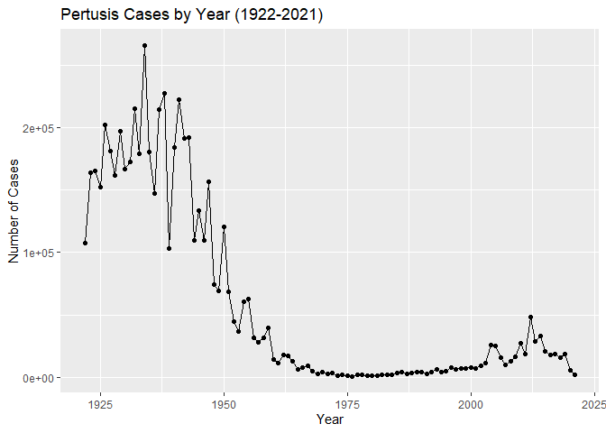
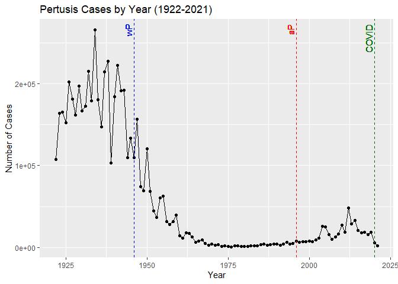
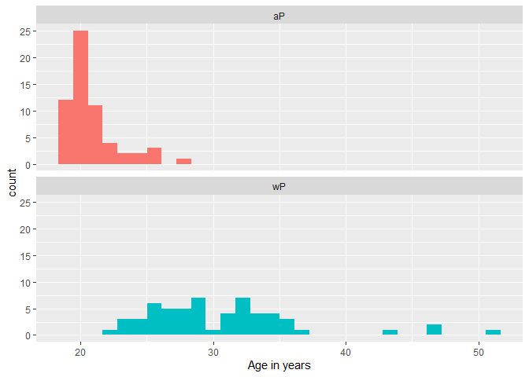
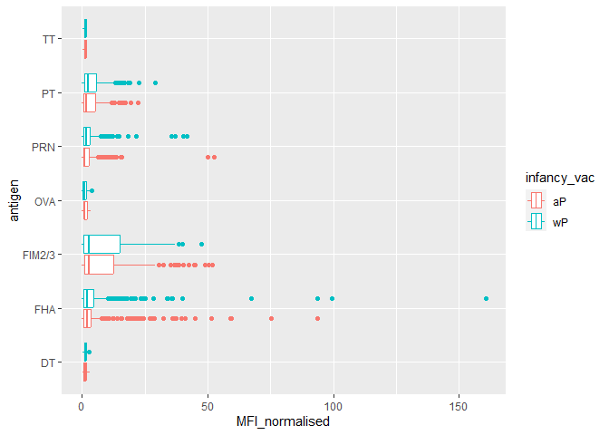
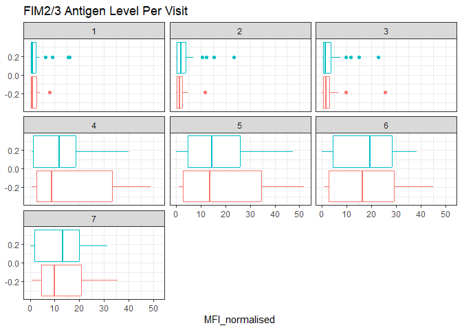
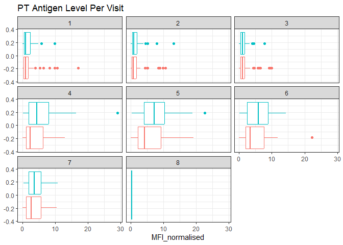
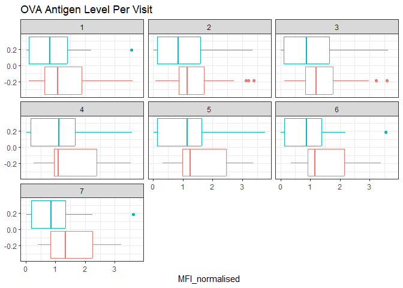
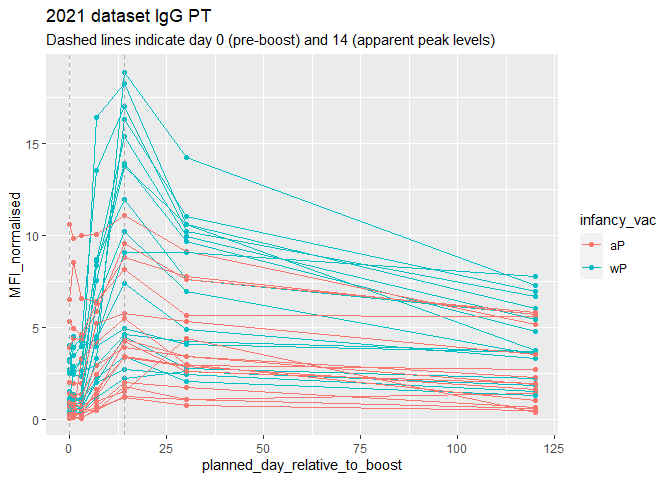
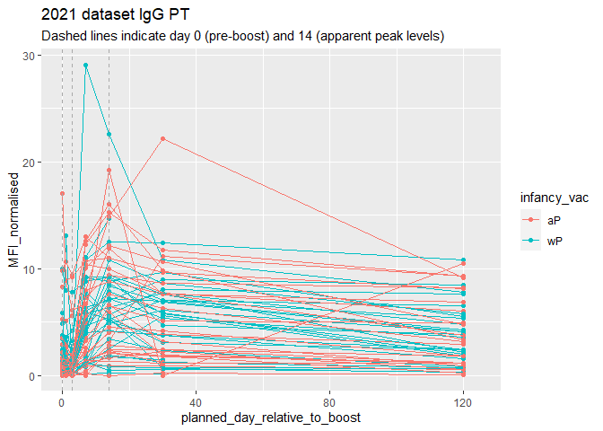
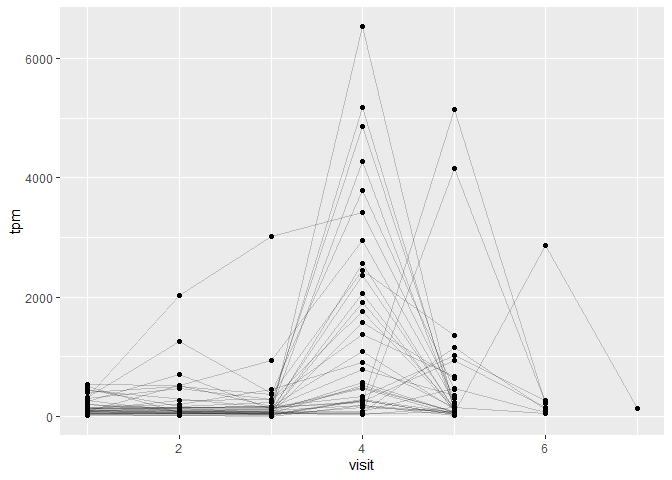

# Class19: Pertussis and the CMI-PB project
Yufei (A16222438)

Pertusis is a severe lung bacterial infection, also known as whooping
cough. It is a deadly disease, while being vaccine-preventable.

We will begin by investigating the number of cases per year in the US,
data available on CDC website
(https://www.cdc.gov/pertussis/surv-reporting/cases-by-year.html).

**Q1.** With the help of the R “addin” package datapasta assign the CDC
pertussis case number data to a data frame called cdc and use ggplot to
make a plot of cases numbers over time.

install “datapasta” –\> copy data table to clipboard –\> addins - paste
as data.frame

Let’s have a look at the data.frame

``` r
head(cdc)
```

      Year  Cases
    1 1922 107473
    2 1923 164191
    3 1924 165418
    4 1925 152003
    5 1926 202210
    6 1927 181411

``` r
library(ggplot2)
```

    Warning: 程辑包'ggplot2'是用R版本4.3.1 来建造的

``` r
p<- ggplot(cdc, aes(Year, Cases)) + 
  geom_line() + 
  geom_point() + 
  labs(y = "Number of Cases", title = "Pertusis Cases by Year (1922-2021)")
p
```



**Q2.** Using the ggplot geom_vline() function add lines to your
previous plot for the 1946 introduction of the wP vaccine and the 1996
switch to aP vaccine (see example in the hint below). What do you
notice?

``` r
p + 
  geom_vline(xintercept = c(1946, 1996, 2020), linetype = "dashed", col = c("blue", "red", "darkgreen"))+ 
  geom_text(x = 1946, y=max(cdc$Cases), label = "wP", vjust = -0.3, angle = 90, col = "blue")+
  geom_text(x = 1996, y=max(cdc$Cases), label = "aP", vjust = -0.3, angle = 90, col = "red")+
  geom_text(x = 2020, y=max(cdc$Cases), label = "COVID", vjust = -0.3, hjust = 0.8, angle = 90, col = "darkgreen")
```



**Q3.** Describe what happened after the introduction of the aP vaccine?
Do you have a possible explanation for the observed trend?

There is a ~3 year lag, and then the number of cases raised a little
bit. If the immune response triggered by aP is less than that of wP, the
effect takes time to show as the wP-protected baby in the population
decreases to facilitate the spread of the disease.

\#Explore CMI-PB database

The CMI-PB project (https://www.cmi-pb.org/) makes its data available
via “API-endpoint” that returns JSON format.

We will use the **jsonlite** package to access the data. The main
function in this package is called `read_json()`.

``` r
library(jsonlite)
```

    Warning: 程辑包'jsonlite'是用R版本4.3.2 来建造的

``` r
#Subject table
subject <- read_json("https://www.cmi-pb.org/api/subject", simplifyVector = TRUE)
specimen <- read_json("https://www.cmi-pb.org/api/specimen", simplifyVector = TRUE)
titer <-read_json("https://www.cmi-pb.org/api/v4/plasma_ab_titer", simplifyVector = TRUE)
```

let us look at the data

``` r
head(subject,3)
```

      subject_id infancy_vac biological_sex              ethnicity  race
    1          1          wP         Female Not Hispanic or Latino White
    2          2          wP         Female Not Hispanic or Latino White
    3          3          wP         Female                Unknown White
      year_of_birth date_of_boost      dataset
    1    1986-01-01    2016-09-12 2020_dataset
    2    1968-01-01    2019-01-28 2020_dataset
    3    1983-01-01    2016-10-10 2020_dataset

``` r
head(specimen,3)
```

      specimen_id subject_id actual_day_relative_to_boost
    1           1          1                           -3
    2           2          1                            1
    3           3          1                            3
      planned_day_relative_to_boost specimen_type visit
    1                             0         Blood     1
    2                             1         Blood     2
    3                             3         Blood     3

``` r
head(titer,3)
```

      specimen_id isotype is_antigen_specific antigen        MFI MFI_normalised
    1           1     IgE               FALSE   Total 1110.21154       2.493425
    2           1     IgE               FALSE   Total 2708.91616       2.493425
    3           1     IgG                TRUE      PT   68.56614       3.736992
       unit lower_limit_of_detection
    1 UG/ML                 2.096133
    2 IU/ML                29.170000
    3 IU/ML                 0.530000

**Q4.** How many aP and wP infancy vaccinated subjects are in the
dataset?

``` r
table(subject$infancy_vac)
```


    aP wP 
    60 58 

**Q5.** How many Male and Female subjects/patients are in the dataset?

``` r
table(subject$biological_sex)
```


    Female   Male 
        79     39 

**Q6.** What is the breakdown of race and biological sex (e.g. number of
Asian females, White males etc…)?

``` r
table(subject$race, subject$biological_sex)
```

                                               
                                                Female Male
      American Indian/Alaska Native                  0    1
      Asian                                         21   11
      Black or African American                      2    0
      More Than One Race                             9    2
      Native Hawaiian or Other Pacific Islander      1    1
      Unknown or Not Reported                       11    4
      White                                         35   20

## Side-Note: Working with dates

**Q7.** Using this approach determine (i) the average age of wP
individuals, (ii) the average age of aP individuals; and (iii) are they
significantly different?

``` r
library(lubridate)
```

    Warning: 程辑包'lubridate'是用R版本4.3.2 来建造的


    载入程辑包：'lubridate'

    The following objects are masked from 'package:base':

        date, intersect, setdiff, union

``` r
#how many days I have lived on earth
today()-ymd("2001-12-09")
```

    Time difference of 8033 days

``` r
#how many seconds I have been alive
time_length(today()-ymd("2001-12-09"), "seconds")
```

    [1] 694051200

``` r
subject$age <- time_length(today() - ymd(subject$year_of_birth), "years")

library(dplyr)
```

    Warning: 程辑包'dplyr'是用R版本4.3.1 来建造的


    载入程辑包：'dplyr'

    The following objects are masked from 'package:stats':

        filter, lag

    The following objects are masked from 'package:base':

        intersect, setdiff, setequal, union

``` r
ap <- subject %>% filter(infancy_vac == "aP")
round( summary(ap$age))
```

       Min. 1st Qu.  Median    Mean 3rd Qu.    Max. 
         21      26      26      26      27      30 

``` r
wp <- subject %>% filter(infancy_vac == "wP")
round( summary(wp$age))
```

       Min. 1st Qu.  Median    Mean 3rd Qu.    Max. 
         28      31      35      36      39      56 

**Q8.** Determine the age of all individuals at time of boost?

``` r
subject$age_of_boost <- time_length(ymd(subject$date_of_boost)-ymd(subject$year_of_birth), "years")
head(subject$age_of_boost)
```

    [1] 30.69678 51.07461 33.77413 28.65982 25.65914 28.77481

**Q9.** With the help of a faceted boxplot or histogram, do you think
these two groups are significantly different?

``` r
ggplot(subject) +
  aes(age_of_boost, fill=as.factor(infancy_vac)) +
  geom_histogram(show.legend=FALSE) +
  facet_wrap(vars(infancy_vac), nrow=2) +
  xlab("Age in years")
```

    `stat_bin()` using `bins = 30`. Pick better value with `binwidth`.



We can also calculate the p-value

``` r
# Or use wilcox.test() 
x <- t.test(wp$age,  ap$age)
x$p.value
```

    [1] 6.813505e-19

\#Merge or join tables

**Q9.** Complete the code to join specimen and subject tables to make a
new merged data frame containing all specimen records along with their
associated subject details:

``` r
meta <- inner_join(specimen, subject)
```

    Joining with `by = join_by(subject_id)`

``` r
head(meta)
```

      specimen_id subject_id actual_day_relative_to_boost
    1           1          1                           -3
    2           2          1                            1
    3           3          1                            3
    4           4          1                            7
    5           5          1                           11
    6           6          1                           32
      planned_day_relative_to_boost specimen_type visit infancy_vac biological_sex
    1                             0         Blood     1          wP         Female
    2                             1         Blood     2          wP         Female
    3                             3         Blood     3          wP         Female
    4                             7         Blood     4          wP         Female
    5                            14         Blood     5          wP         Female
    6                            30         Blood     6          wP         Female
                   ethnicity  race year_of_birth date_of_boost      dataset
    1 Not Hispanic or Latino White    1986-01-01    2016-09-12 2020_dataset
    2 Not Hispanic or Latino White    1986-01-01    2016-09-12 2020_dataset
    3 Not Hispanic or Latino White    1986-01-01    2016-09-12 2020_dataset
    4 Not Hispanic or Latino White    1986-01-01    2016-09-12 2020_dataset
    5 Not Hispanic or Latino White    1986-01-01    2016-09-12 2020_dataset
    6 Not Hispanic or Latino White    1986-01-01    2016-09-12 2020_dataset
           age age_of_boost
    1 37.93018     30.69678
    2 37.93018     30.69678
    3 37.93018     30.69678
    4 37.93018     30.69678
    5 37.93018     30.69678
    6 37.93018     30.69678

**Q10.** Now using the same procedure join meta with titer data so we
can further analyze this data in terms of time of visit aP/wP,
male/female etc.

Antibody measurments in the blood

``` r
abdata <- inner_join(titer, meta)
```

    Joining with `by = join_by(specimen_id)`

``` r
head(abdata)
```

      specimen_id isotype is_antigen_specific antigen        MFI MFI_normalised
    1           1     IgE               FALSE   Total 1110.21154       2.493425
    2           1     IgE               FALSE   Total 2708.91616       2.493425
    3           1     IgG                TRUE      PT   68.56614       3.736992
    4           1     IgG                TRUE     PRN  332.12718       2.602350
    5           1     IgG                TRUE     FHA 1887.12263      34.050956
    6           1     IgE                TRUE     ACT    0.10000       1.000000
       unit lower_limit_of_detection subject_id actual_day_relative_to_boost
    1 UG/ML                 2.096133          1                           -3
    2 IU/ML                29.170000          1                           -3
    3 IU/ML                 0.530000          1                           -3
    4 IU/ML                 6.205949          1                           -3
    5 IU/ML                 4.679535          1                           -3
    6 IU/ML                 2.816431          1                           -3
      planned_day_relative_to_boost specimen_type visit infancy_vac biological_sex
    1                             0         Blood     1          wP         Female
    2                             0         Blood     1          wP         Female
    3                             0         Blood     1          wP         Female
    4                             0         Blood     1          wP         Female
    5                             0         Blood     1          wP         Female
    6                             0         Blood     1          wP         Female
                   ethnicity  race year_of_birth date_of_boost      dataset
    1 Not Hispanic or Latino White    1986-01-01    2016-09-12 2020_dataset
    2 Not Hispanic or Latino White    1986-01-01    2016-09-12 2020_dataset
    3 Not Hispanic or Latino White    1986-01-01    2016-09-12 2020_dataset
    4 Not Hispanic or Latino White    1986-01-01    2016-09-12 2020_dataset
    5 Not Hispanic or Latino White    1986-01-01    2016-09-12 2020_dataset
    6 Not Hispanic or Latino White    1986-01-01    2016-09-12 2020_dataset
           age age_of_boost
    1 37.93018     30.69678
    2 37.93018     30.69678
    3 37.93018     30.69678
    4 37.93018     30.69678
    5 37.93018     30.69678
    6 37.93018     30.69678

**Q11.** How many specimens (i.e. entries in abdata) do we have for each
isotype?

``` r
table(abdata$isotype)
```


     IgE  IgG IgG1 IgG2 IgG3 IgG4 
    6698 3240 7968 7968 7968 7968 

**Q12.** What are the different \$dataset values in abdata and what do
you notice about the number of rows for the most “recent” dataset?

``` r
table(abdata$dataset)
```


    2020_dataset 2021_dataset 2022_dataset 
           31520         8085         2205 

The number of sample decreased significantly.

Let’s focus on IgG1

``` r
IgG <- abdata %>% filter (isotype == "IgG")
head(IgG)
```

      specimen_id isotype is_antigen_specific antigen        MFI MFI_normalised
    1           1     IgG                TRUE      PT   68.56614       3.736992
    2           1     IgG                TRUE     PRN  332.12718       2.602350
    3           1     IgG                TRUE     FHA 1887.12263      34.050956
    4          19     IgG                TRUE      PT   20.11607       1.096366
    5          19     IgG                TRUE     PRN  976.67419       7.652635
    6          19     IgG                TRUE     FHA   60.76626       1.096457
       unit lower_limit_of_detection subject_id actual_day_relative_to_boost
    1 IU/ML                 0.530000          1                           -3
    2 IU/ML                 6.205949          1                           -3
    3 IU/ML                 4.679535          1                           -3
    4 IU/ML                 0.530000          3                           -3
    5 IU/ML                 6.205949          3                           -3
    6 IU/ML                 4.679535          3                           -3
      planned_day_relative_to_boost specimen_type visit infancy_vac biological_sex
    1                             0         Blood     1          wP         Female
    2                             0         Blood     1          wP         Female
    3                             0         Blood     1          wP         Female
    4                             0         Blood     1          wP         Female
    5                             0         Blood     1          wP         Female
    6                             0         Blood     1          wP         Female
                   ethnicity  race year_of_birth date_of_boost      dataset
    1 Not Hispanic or Latino White    1986-01-01    2016-09-12 2020_dataset
    2 Not Hispanic or Latino White    1986-01-01    2016-09-12 2020_dataset
    3 Not Hispanic or Latino White    1986-01-01    2016-09-12 2020_dataset
    4                Unknown White    1983-01-01    2016-10-10 2020_dataset
    5                Unknown White    1983-01-01    2016-10-10 2020_dataset
    6                Unknown White    1983-01-01    2016-10-10 2020_dataset
           age age_of_boost
    1 37.93018     30.69678
    2 37.93018     30.69678
    3 37.93018     30.69678
    4 40.93087     33.77413
    5 40.93087     33.77413
    6 40.93087     33.77413

ab response in relation to vaccine type

``` r
ggplot (IgG, aes(MFI_normalised, antigen, col = infancy_vac)) + geom_boxplot()
```



**Q13.** Complete the following code to make a summary boxplot of Ab
titer levels (MFI) for all antigens:

``` r
ggplot(IgG) +
  aes(MFI_normalised, antigen) +
  geom_boxplot() + 
    xlim(0,75) +
  facet_wrap(vars(visit), nrow=2)
```

    Warning: Removed 5 rows containing non-finite values (`stat_boxplot()`).


**Q14.** What antigens show differences in the level of IgG antibody
titers recognizing them over time? Why these and not others? PT, PRN,
FIM2/3, FHA. THe other antigens are not included in this vaccine or only
have very low dose.

We can attempt to examine differences between wP and aP here by setting
color and/or facet values of the plot to include infancy_vac status (see
below). However these plots tend to be rather busy and thus hard to
interpret easily.

``` r
ggplot(IgG) +
  aes(MFI_normalised, antigen, col=infancy_vac ) +
  geom_boxplot(show.legend = FALSE) + 
  facet_wrap(vars(visit), nrow=2) +
  xlim(0,75) +
  theme_bw()
```

    Warning: Removed 5 rows containing non-finite values (`stat_boxplot()`).


Another version of this plot adding infancy_vac to the faceting:

``` r
IgG %>% filter(visit != 8) %>%
ggplot() +
  aes(MFI_normalised, antigen, col=infancy_vac ) +
  geom_boxplot(show.legend = FALSE) + 
  xlim(0,75) +
  facet_wrap(vars(infancy_vac, visit), nrow=2)
```

    Warning: Removed 5 rows containing non-finite values (`stat_boxplot()`).


**Q15.** Filter to pull out only two specific antigens for analysis and
create a boxplot for each.

``` r
# Box plot for FIM2/3
filter(IgG, antigen=="FIM2/3") %>%
  ggplot() +
  aes(MFI_normalised, col=infancy_vac) +
  geom_boxplot(show.legend = FALSE) +
  facet_wrap(vars(visit)) +
  theme_bw() +
  labs(title = "FIM2/3 Antigen Level Per Visit")
```



``` r
#Box plot for PT
filter(IgG, antigen=="PT") %>%
  ggplot() +
  aes(MFI_normalised, col=infancy_vac) +
  geom_boxplot(show.legend = FALSE) +
  facet_wrap(vars(visit)) +
  theme_bw() +
  labs(title = "PT Antigen Level Per Visit")
```



``` r
#Box plot for OVA
filter(IgG, antigen=="OVA") %>%
  ggplot() +
  aes(MFI_normalised, col=infancy_vac) +
  geom_boxplot(show.legend = FALSE) +
  facet_wrap(vars(visit)) +
  theme_bw() +
  labs(title = "OVA Antigen Level Per Visit")
```



**Q16.** What do you notice about these two antigens time courses and
the PT data in particular? The FIM2/3 and PT started to increase largely
at the 4th visit, and dropped at the 7th visit, whereas the OVA antigen
level is rather stable.

**Q17.** Do you see any clear difference in aP vs. wP responses?
No. They are pretty similar.

Lets finish this section by looking at the 2021 dataset IgG PT antigen
levels time-course:

``` r
IgG.pt.2021 <- IgG %>% filter (antigen == "PT", dataset == "2021_dataset")

ggplot(IgG.pt.2021) + 
  aes(planned_day_relative_to_boost, MFI_normalised, col = infancy_vac, group = subject_id) +
  geom_point() +
  geom_line() +
  geom_vline(xintercept = c(0,14), linetype = "dashed", col = "darkgrey") +
  labs(title="2021 dataset IgG PT",
       subtitle = "Dashed lines indicate day 0 (pre-boost) and 14 (apparent peak levels)")
```



**Q18.** Does this trend look similar for the 2020 dataset?

``` r
IgG.pt.2020 <- IgG %>% filter (antigen == "PT", dataset == "2020_dataset")

ggplot(IgG.pt.2020) + 
  aes(planned_day_relative_to_boost, MFI_normalised, col = infancy_vac, group = subject_id) +
  geom_point() +
  geom_line() +
  geom_vline(xintercept = c(0,3,14), linetype = "dashed", col = "darkgrey") +
  labs(title="2021 dataset IgG PT",
       subtitle = "Dashed lines indicate day 0 (pre-boost) and 14 (apparent peak levels)") +
  xlim(c(0,125))
```

    Warning: Removed 3 rows containing missing values (`geom_point()`).

    Warning: Removed 3 rows containing missing values (`geom_line()`).



The trend is slightly different: general trend is similar in that the ab
titer is relatively low at the beginning, peaked at day 14, and reduced
gradually to a stable level. However, there is a slight decrease in ab
titer from day0~3, which is not observed in the 2021 dataset.

# Obtaining CMI-PB RNASeq data

Let’s read available RNA-Seq data for IGHG1 gene, involved in IgG
production, into R and investigate the time course of it’s gene
expression values.

``` r
rna <- read_json("https://www.cmi-pb.org/api/v2/rnaseq?versioned_ensembl_gene_id=eq.ENSG00000211896.7", simplifyVector = TRUE) 
```

To facilitate further analysis we need to “join” the rna expression data
with our metadata meta, which is itself a join of sample and specimen
data. This will allow us to look at this genes TPM expression values
over aP/wP status and at different visits (i.e. times):

``` r
#meta <- inner_join(specimen, subject)
ssrna <- inner_join(rna, meta)
```

    Joining with `by = join_by(specimen_id)`

**Q19.** Make a plot of the time course of gene expression for IGHG1
gene (i.e. a plot of visit vs. tpm).

``` r
ggplot(ssrna) +
  aes(visit, tpm, group=subject_id) +
  geom_point() +
  geom_line(alpha=0.2)
```



**Q20.** What do you notice about the expression of this gene (i.e. when
is it at it’s maximum level)? It peaked at 4th visit

**Q21.** Does this pattern in time match the trend of antibody titer
data? If not, why not? No, the peak is at 4th visit (7th day
post-boost), which is before the peak in ab titer data. It makes sense
as it takes some time from mRNA in cell to secreted mature ab in the
blood, and that the secreted ab accumulate in the blood.
